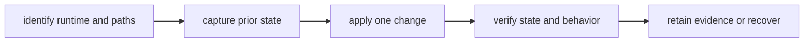

# Operator Workflows

State-changing `bijux` work follows one discipline: establish the target,
preserve the prior state, make one bounded change, and verify the resulting
state through a separate read path. A successful mutation response proves that
the command completed; it does not by itself prove that precedence, routing,
or later execution now behaves as intended.

## Operating Sequence



Use compact JSON for automation and incident records:

```bash
bijux version --format json --no-pretty
bijux status --format json --no-pretty
bijux doctor paths --format json --no-pretty
```

`doctor paths` matters before a mutation because the current directory,
project discovery, profiles, and environment can change which configuration,
memory, history, or plugin registry is active. Never infer the target file
from a previous shell session.

## Configuration Changes

Read the effective value and its source before editing:

```bash
bijux config explain theme --format json --no-pretty
bijux config validate --format json --no-pretty
bijux config export ./artifacts/bijux-config-before.env
```

Then perform one operation such as:

```bash
bijux config set theme=compact
bijux config unset theme
bijux config load ./approved-config.env
```

Verify both syntax and precedence:

```bash
bijux config validate --format json --no-pretty
bijux config explain theme --format json --no-pretty
```

`config load` can alter multiple keys and deserves the same review as a batch
change. Inspect the input and export the current state first. Use
`config export --portable` when the evidence must describe logical keys rather
than machine-local storage. Portable output redacts secret-like values by
default, so it is useful for review but may not be a complete restoration
bundle.

If global configuration is malformed, run `config repair` only after capturing
the parse error and resolved path. Repair writes a backup before replacing the
malformed file. Preserve that backup until validation and the original failing
workflow both pass.

## Plugin Lifecycle

A plugin manifest, trust classification, and checksum are metadata, not a
sandbox or publisher attestation. Installing or enabling a plugin authorizes
code to run with the current user’s filesystem, network, and credential
access.

Before installation:

1. Review the manifest, entrypoint, and dependency source.
2. Capture `bijux plugins list --format json --no-pretty`.
3. Remove unnecessary credentials from `BIJUX_*` and `PYTHON*` environment
   variables.
4. Use a restricted operating-system account or container when the source is
   outside the existing trust boundary.

Install from the reviewed manifest and identify its source deliberately:

```bash
bijux plugins install ./plugin.manifest.json --source local-review
bijux plugins inspect sample --format json --no-pretty
bijux plugins check sample --format json --no-pretty
bijux plugins doctor --format json --no-pretty
```

Verification must confirm the canonical namespace, source path, manifest
checksum, compatibility result, trust class, and lifecycle state. A listed
plugin is not necessarily enabled or runnable, and an enabled plugin is not
necessarily safe.

For suspected or failing code, disable first:

```bash
bijux plugins disable sample
bijux plugins inspect sample --format json --no-pretty
```

Disabling preserves the registry record for diagnosis while preventing route
execution. Uninstall only after retaining the manifest, inspection report,
checksum, and evidence needed for the investigation. After uninstalling, prove
both absence and route health with `plugins list`, `plugins doctor`, and
`doctor routing`.

## Memory And History

Memory is mutable runtime state. Capture the affected key or complete bounded
inventory before changing it:

```bash
bijux memory get session.id --format json --no-pretty
bijux memory set session.id=abc123
bijux memory get session.id --format json --no-pretty
```

Use `memory delete` for one known key. Reserve `memory clear` for a confirmed
whole-store reset, and verify with `memory list`.

History is operational evidence. Query it with explicit filters and limits
before deletion. `history clear --force` is the recovery route for a corrupted
history file as well as an intentional destructive action; record why it was
used and verify the resulting bounded history view.

## Completion Criteria

An operator change is complete only when:

- the runtime version and resolved state paths were captured;
- the previous value, record, or inventory was retained when recovery matters;
- one bounded mutation was applied;
- a separate read command confirms the stored result;
- `status`, focused diagnostics, or the original workflow confirms behavior;
- secrets and plugin output were reviewed before evidence was shared.

On failure, stop applying mutations. Preserve stderr and the exit code, run the
focused diagnostic surface, and follow [Failure Recovery](../operations/failure-recovery.md).
Broad deletion hides causality and is not a valid diagnostic strategy.

## Authorities

- [Configuration Surface](configuration-surface.md) defines precedence,
  import, export, validation, and repair.
- [Security and Safety](../operations/security-and-safety.md) defines plugin
  process and credential boundaries.
- [Diagnostics Guide](../operations/diagnostics-guide.md) defines evidence
  collection and escalation.
- `crates/bijux-cli/src/interface/cli/handlers/` owns command presentation.
- `crates/bijux-cli/src/features/` owns state and lifecycle behavior.
