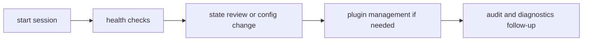

# Operator Workflows

This page explains the normal operator paths through the CLI when the goal is
to inspect state, change state, or recover confidence.

The workflows are ordinary on purpose: check health, adjust state, verify the
result, and keep the next run easier to explain.

## Workflow Map

## Core Workflows

- baseline health: `status`, `doctor`, `audit`
- configuration updates: `config set/get/export/load`
- session memory and history review: `memory ...`, `history ...`
- plugin management: `plugins install/check/enable/disable/uninstall`
- path and environment discovery: `cli paths`, `plugins where`

## Workflow Rules

- run status/doctor before deep debugging changes
- prefer structured output for script automation
- validate plugin health after install or compatibility updates
- keep config changes explicit and exportable for reproducibility

## Code Anchors

- `crates/bijux-cli/src/interface/cli/handlers/cli.rs`
- `crates/bijux-cli/src/interface/cli/handlers/config.rs`
- `crates/bijux-cli/src/interface/cli/handlers/history.rs`
- `crates/bijux-cli/src/interface/cli/handlers/memory.rs`
- `crates/bijux-cli/src/interface/cli/handlers/plugins.rs`

## Reading Rule

Use this page when the question is not which single command exists, but which
safe sequence gets an operator from uncertainty back to a verified state.

## Next Reads

- [Common Workflows](../operations/common-workflows.md)
- [Diagnostics Guide](../operations/diagnostics-guide.md)
- [Review Checklist](../quality/review-checklist.md)
