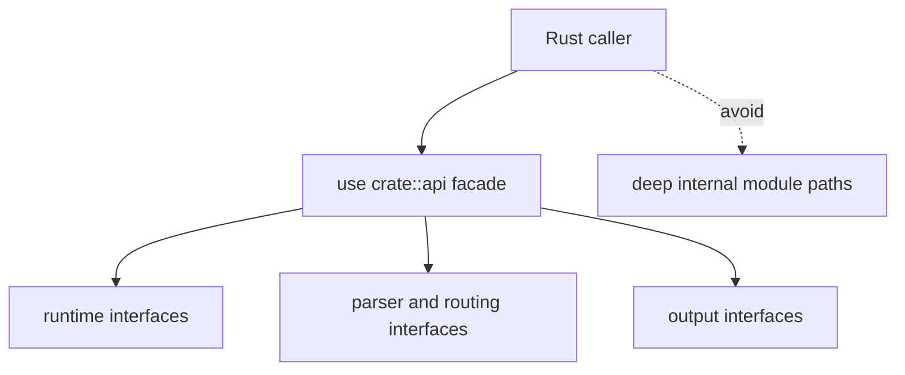

# Public Imports

This page records the import paths `bijux-cli` wants downstream Rust callers to
prefer.

The reason is simple: integrations stay easier to upgrade when they depend on
the intended facade instead of deep internal paths.

## Import Map

## Preferred Imports

- `bijux_cli::api::runtime::*`
- `bijux_cli::api::parser::*`
- `bijux_cli::api::routing::*`
- `bijux_cli::api::output::*`
- `bijux_cli::api::diagnostics::*`
- `bijux_cli::api::repl::*`

## Import Guidance

- import from `api` when building tools or tests against runtime behavior
- avoid importing private module internals that are not part of facade intent
- when new facade exports are added, document them in this page

## Reading Rule

Use this page when a Rust integration needs CLI behavior but the correct import
boundary is still unclear.

## Code Anchors

- `crates/bijux-cli/src/api/mod.rs`
- `crates/bijux-cli/src/lib.rs`
- `crates/bijux-cli/Cargo.toml`

## Next Reads

- [API Surface](api-surface.md)
- [Compatibility Commitments](compatibility-commitments.md)
- [Dependency Governance](../quality/dependency-governance.md)
