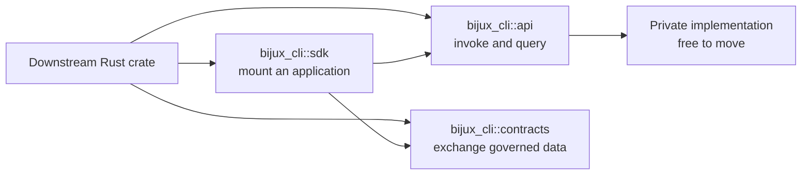

# Public Imports

`bijux-cli` exposes three Rust integration lanes. Choose the lane by what the
caller owns; do not reach through a public facade into its private
implementation.

| Caller need | Import root | Contract |
| --- | --- | --- |
| invoke or inspect CLI behavior | `bijux_cli::api` | runtime facade |
| exchange typed data with the CLI | `bijux_cli::contracts` | data contract |
| mount a Rust application below `bijux` | `bijux_cli::sdk` | app integration |

The crate root intentionally keeps `bootstrap`, `features`, `infrastructure`,
`interface`, `kernel`, `routing`, and `shared` private. Their paths describe
implementation ownership, not supported downstream dependencies.



The facade roots are compatibility boundaries. The arrows from `sdk` describe
composition, not permission for downstream code to reach private modules.

## Invoke CLI Behavior

Use `api` when a Rust process needs the behavior of the command runtime without
spawning the `bijux` executable.

```rust
use bijux_cli::api::runtime::run_app;

let argv = vec!["bijux".to_string(), "status".to_string()];
let result = run_app(&argv)?;
assert_eq!(result.exit_code, 0);
```

Import the narrowest facade module that owns the operation:

- `api::runtime` for process-independent command execution;
- `api::parser` and `api::routing` for command intent and route queries;
- `api::output` for root-compatible rendering;
- `api::config`, `api::diagnostics`, `api::install`, and `api::plugins` for
  focused runtime queries;
- `api::repl` for interactive-session contracts;
- `api::kernel`, `api::telemetry`, and `api::version` for their named runtime
  surfaces.

Do not use `api` merely to obtain a data type. If the type is a command,
envelope, execution-policy, plugin, schema, or product-mount contract, import
it from `contracts` so the dependency states its real purpose.

## Exchange Typed Contracts

Use `contracts` when code serializes, validates, stores, or reasons about data
shared with the CLI. The module exports versioned envelopes, execution policy,
command paths, plugin manifests, product descriptors, schema generators, and
read-only contract queries.

```rust
use bijux_cli::contracts::{
    command_envelope_v1_schema, CommandPath, OutputFormat, PluginManifestV2,
};
```

Version suffixes such as `OutputEnvelopeV1` identify a wire-shape generation.
An unversioned Rust type is not permission to persist its serialized form
without reviewing its `serde` contract and the compatibility commitments.

## Mount A Rust App

Use `sdk` when a product needs a namespace, entrypoint, root-compatible output,
diagnostics, or an in-process test harness.

```rust
use bijux_cli::sdk::ProductMount;

let mount = ProductMount::new("hello")?
    .binary("bijux-hello")
    .summary("Hello application");

let descriptor = mount.build_descriptor()?;
assert_eq!(descriptor.namespace.as_str(), "hello");
```

`ProductMount` builds the descriptor consumed by the root runtime.
`CommandContext` and `CommandResult` carry invocation and output semantics.
`BijuxCliHarness` verifies an app without launching a child process. Use the
[App Integration Guide](app-integration-guide.md) for the complete mounted-app
workflow.

## Dependency Review

Before accepting a new `bijux-cli` import in another crate, verify:

1. The import begins with `api`, `contracts`, or `sdk`.
2. The chosen lane matches behavior, data, or app integration ownership.
3. A narrower module cannot express the dependency more clearly.
4. Persisted JSON uses an explicitly governed schema or versioned envelope.
5. Upgrade tests cover the behavior or payload the caller relies on.

## Stability By Lane

| Lane | Compatibility expectation | Caller obligation |
| --- | --- | --- |
| `api` function or query | behavior, error classification, and returned public types follow documented compatibility | handle documented failure results and avoid depending on private side effects |
| `contracts` versioned type or schema | serialized shape and semantic vocabulary change through governed versioning | persist only declared wire contracts and retain version identity |
| `contracts` unversioned Rust type | source compatibility follows the public crate policy; serialized stability is not implied | do not invent a storage format from incidental `serde` output |
| `sdk` mount descriptor and context | mounted apps retain root routing, output, and lifecycle expectations | keep product behavior inside the app and test root integration |

Re-exporting a facade type from another crate creates a consumer of that
contract. It does not transfer ownership or make private implementation paths
stable.

## Error And Process Boundary

In-process calls do not have shell stream separation by themselves. Preserve
the returned `CommandResult` or runtime result until the integration boundary
decides how payload, stdout, stderr, and exit status are represented. Avoid
turning all non-zero outcomes into one host-language exception; usage,
validation, policy, delegated, and internal failures carry different
operational meaning.

Use the executable rather than the Rust API when process isolation, installed
binary verification, shell-level stream behavior, or cross-language
integration is the contract under test.

## Upgrade Proof

For a downstream integration:

1. compile against the new public facade without private-path imports;
2. run representative success, usage failure, and runtime failure cases;
3. validate persisted envelopes or manifests against their governed schema;
4. compare human and machine behavior only for their documented contracts;
5. verify mounted namespace collision, descriptor, and lifecycle behavior when
   using `sdk`;
6. smoke-test the packaged binary separately when the application ships it.

An internal refactor may move code behind these roots without preserving its
old source path. A public contract change still requires the compatibility
review and release notes described in
[Compatibility Commitments](compatibility-commitments.md).

## Authorities

- `crates/bijux-cli/src/lib.rs` defines the public roots.
- `crates/bijux-cli/src/api/mod.rs` defines runtime facade modules.
- `crates/bijux-cli/src/contracts/mod.rs` defines typed contract exports.
- `crates/bijux-cli/src/sdk/mod.rs` defines mounted-app integration.
- [API Surface](api-surface.md) maps facade modules to their ownership.
- [Data Contracts](data-contracts.md) defines cross-process and persisted
  shapes.
- [App Integration Guide](app-integration-guide.md) carries the end-to-end
  mounted-product workflow.
