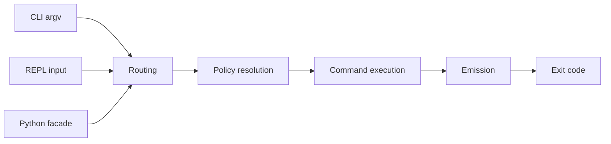
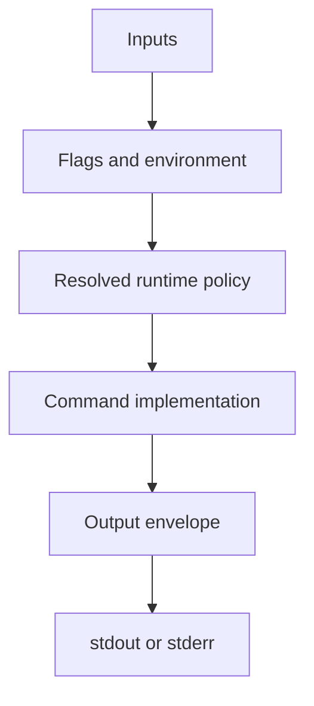

# Command Model

## Mental Model

Think about Bijux as one execution pipeline with several entry surfaces. The
important question is not whether a command came from the CLI, REPL, or Python
package. The important question is whether it passed through the same runtime
law.

This diagram shows the shared execution spine: different entry surfaces may
start the run, but they all converge on one routing, policy, execution, and
emission path before an exit code is produced.

This companion diagram narrows the focus to policy resolution. It shows that
inputs are combined before command logic runs, so formatting and stream
behavior are consequences of resolved policy rather than ad hoc handler code.

## Stable Ideas

- flags should resolve deterministically
- command execution should not depend on hidden mutable globals
- output formatting belongs to the shared emission layer, not to each command
- CLI and REPL should describe the same command world

## Execution Rules

Each run follows a small set of rules that keep behavior predictable:

- parsing should stay pure and build the command request without side effects
- policy should be resolved once and not mutated later
- fast paths such as `--help` and `--version` should not initialize the full
  runtime
- output routing should be decided once and enforced consistently

When one of those rules leaks, the usual symptoms are nondeterministic output,
CLI and Python parity drift, or inconsistent exit behavior.

## Practical Consequence

If you are debugging behavior, ask these questions in order:

1. What route was selected?
2. What policy was resolved from flags, config, and environment?
3. What command logic ran?
4. What output envelope was emitted?
5. What exit code was produced?

## Where This Matters

This model is why Bijux is suitable for automation. It reduces the amount of
surface-specific reasoning users need to do once the command set grows.

## Read Next

- [Limits And Guarantees](limits-and-guarantees.md)
- [Execution Pipeline](../../bijux-core/architecture/execution-pipeline.md)
- [Routing And Surfaces](../../bijux-core/architecture/routing-and-surfaces.md)
