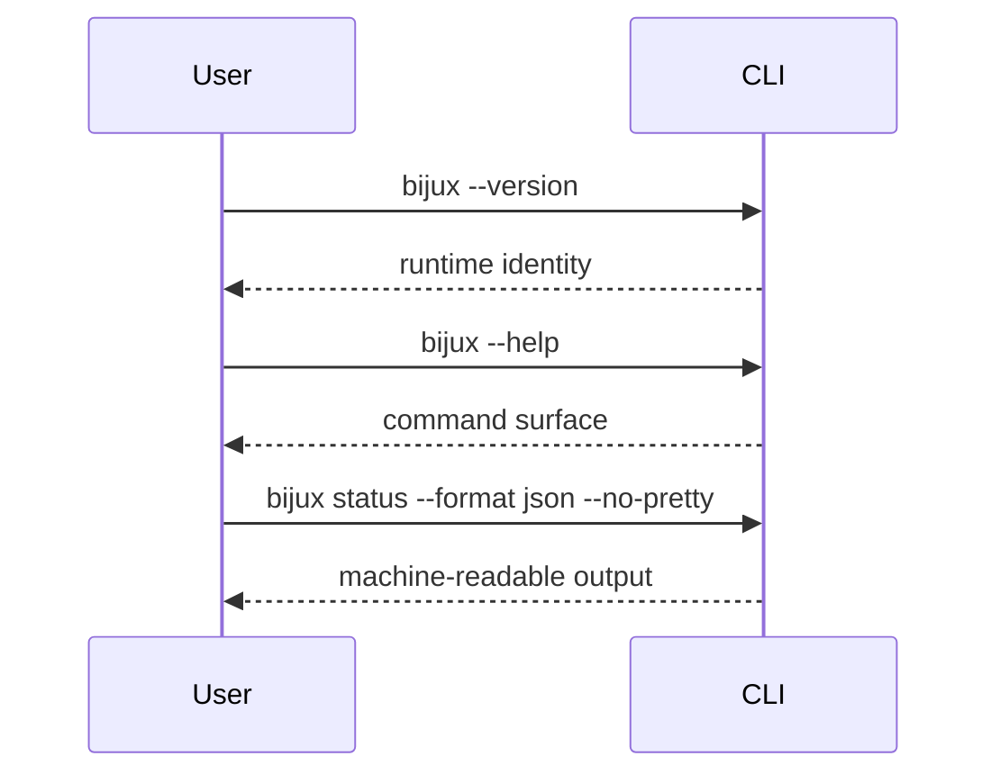
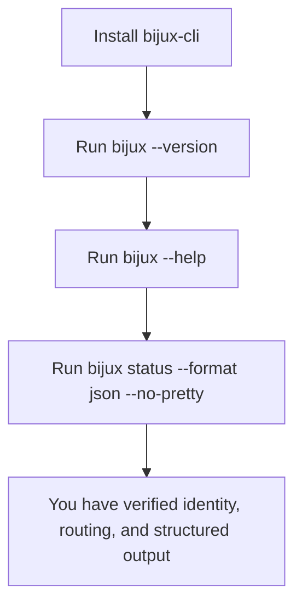

# First Run

## Goal

Use this page when you want the shortest honest verification that the installed
runtime works.



This sequence shows the smallest honest verification loop: identity first, then
help generation, then one ordinary command rendered as machine-readable output.



This flowchart summarizes what each verification step adds. By the end of the
path, you have checked that the binary resolves, the command tree renders, and
the runtime can emit stable structured output.

## Minimal Verification

Run these commands:

```bash
bijux --version
bijux --help
bijux status --format json --no-pretty
```

## What Each Step Proves

- `bijux --version` proves the installed entrypoint resolves and reports runtime
  identity
- `bijux --help` proves routing and help generation are available
- `bijux status --format json --no-pretty` proves normal command execution and
  structured output emission

## What This Does Not Prove

These commands do not prove:

- plugin lifecycle behavior
- configuration file workflows
- REPL operation
- release-channel compatibility beyond the installed package you are running

## If Any Step Fails

Go to:

- [Install and verify](../getting-started/install-and-verify.md)
- [Installation and recovery](../getting-started/installation-and-recovery.md)
- [Command surface](../reference/command-surface.md)
- [Testing and evidence](../../bijux-dev/development/testing-and-evidence.md)

## Read Next

If the runtime works, continue to [Getting started](../getting-started/index.md)
or return to [Command Model](command-model.md).
