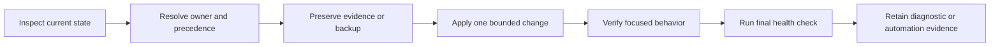

# Common Workflows

Use this page to route an operational question to its owning guide. The
[operator lifecycle](../interfaces/operator-workflows.md) defines the common
read-modify-verify discipline; these pages own the detailed behavior.

Read-only investigation can stop after `explain`. State-changing workflows
continue through backup and final health verification. Skipping directly to a
write makes it harder to distinguish the original defect from damage caused by
the attempted repair.

## Workflow Index

| Need | Start here | Evidence to retain |
| --- | --- | --- |
| establish runtime health | [Diagnostics Guide](diagnostics-guide.md) | focused findings, resolved paths, and bundle location when exported |
| install and initialize the runtime | [Installation And Setup](installation-and-setup.md) | version, executable resolution, and initial doctor result |
| recover from corrupted or conflicting state | [Failure Recovery](failure-recovery.md) | original diagnosis, backup path, repair result, and final validation |
| understand configuration precedence | [Configuration Surface](../interfaces/configuration-surface.md) | effective value and source chain |
| operate plugins safely | [Operator Workflows](../interfaces/operator-workflows.md) | pre-change inventory and post-change health check |
| automate command consumption | [CLI Surface](../interfaces/cli-surface.md) | stable command path, structured envelope, and exit behavior |

## State-Specific Routes

| Symptom | First command family | Do not start with |
| --- | --- | --- |
| unexpected config value | `config show`, `config explain`, `config diff` | editing every possible config source |
| history or memory appears missing | path diagnostics and focused list/query commands | deleting the state directory |
| plugin route is unknown | `plugins list`, `plugins inspect`, route diagnostics | reinstalling all plugins |
| mounted application is unavailable | `apps which`, `apps version`, `apps doctor` | treating it as plugin registry corruption |
| output differs under automation | explicit `--format json --no-pretty` and captured exit status | parsing human text |
| command cannot be resolved | executable and installation diagnostics | changing application data |

Plugin state and mounted-application state have different owners. The root
runtime reserves and routes both, but `plugins` manages operator-installed
registry records while `apps` diagnoses known product mounts.

## Safe Mutation Rules

- Capture the effective path and precedence chain before editing config.
- Back up a corrupted registry before any repair-capable diagnostic.
- Disable one suspect plugin before changing unrelated extension state.
- Preserve stdout, stderr, and exit status separately in automation.
- Treat structured validation failure as failure even when a partial payload
  was emitted.
- Re-run the same focused inspection after mutation, then run `bijux doctor`
  for cross-surface health.

## Completion Evidence

An operational workflow is complete when the original symptom is reproduced
or explained, the owning state is identified, the bounded change is visible,
and final diagnostics agree. A command returning zero without the expected
state or artifact is not sufficient.

## Code Anchors

- `crates/bijux-cli/src/interface/cli/handlers/root.rs`
- `crates/bijux-cli/src/interface/cli/handlers/config.rs`
- `crates/bijux-cli/src/interface/cli/handlers/memory.rs`
- `crates/bijux-cli/src/interface/cli/handlers/history.rs`
- `crates/bijux-cli/src/interface/cli/handlers/plugins.rs`
- `crates/bijux-cli/src/routing/registry.rs`
- `crates/bijux-cli/src/features/plugins/`

## Continue Reading

- [Diagnostics Guide](diagnostics-guide.md)
- [Operator Workflows](../interfaces/operator-workflows.md)
- [Review Checklist](../quality/review-checklist.md)
