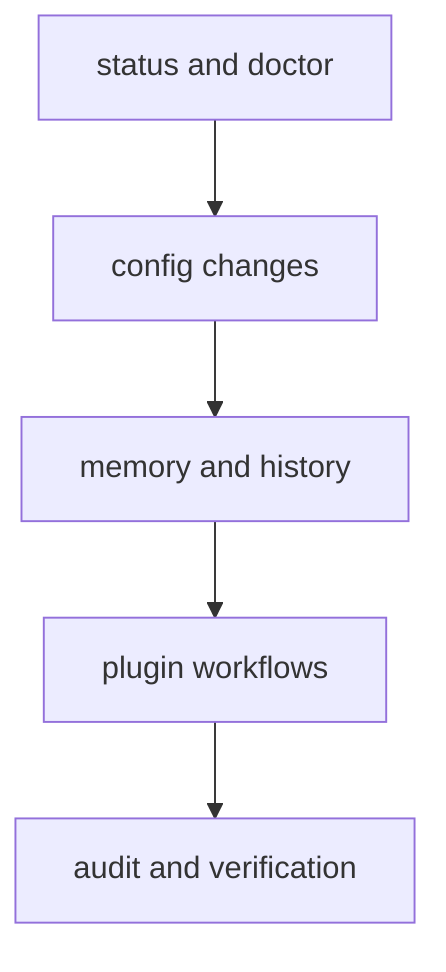

# Common Workflows

This page collects the CLI workflows people reach for most often.

The goal is not to list every command. It is to show the routine paths that
help someone move from a quick health check to a deliberate state change.

## Workflow Map



## Workflow Set

- runtime health: `status`, `doctor`, `audit`
- configuration: `config list/get/set/unset/export/load`
- memory state: `memory list/get/set/delete/clear`
- history management: `history --limit/--filter/--sort` and `history clear --force`
- plugin lifecycle: install, inspect, check, enable/disable, uninstall

## Example Session

```bash
bijux status --format json --no-pretty
bijux config set profile=dev
bijux memory set context=oncall
bijux history --limit 25 --sort timestamp
bijux plugins list
```

## Code Anchors

- `crates/bijux-cli/src/interface/cli/handlers/root.rs`
- `crates/bijux-cli/src/interface/cli/handlers/config.rs`
- `crates/bijux-cli/src/interface/cli/handlers/memory.rs`
- `crates/bijux-cli/src/interface/cli/handlers/history.rs`
- `crates/bijux-cli/src/interface/cli/handlers/plugins.rs`

## Workflow Rules

- prefer explicit options over implicit defaults in automation
- validate plugin health after each lifecycle mutation
- keep state changes observable with status and diagnostics checks

## Reading Rule

Use this page when the question is not "what command exists?" but "what is the
normal sequence for getting this done safely?"

## Next Reads

- [Observability and Diagnostics](observability-and-diagnostics.md)
- [Operator Workflows](../interfaces/operator-workflows.md)
- [Review Checklist](../quality/review-checklist.md)
