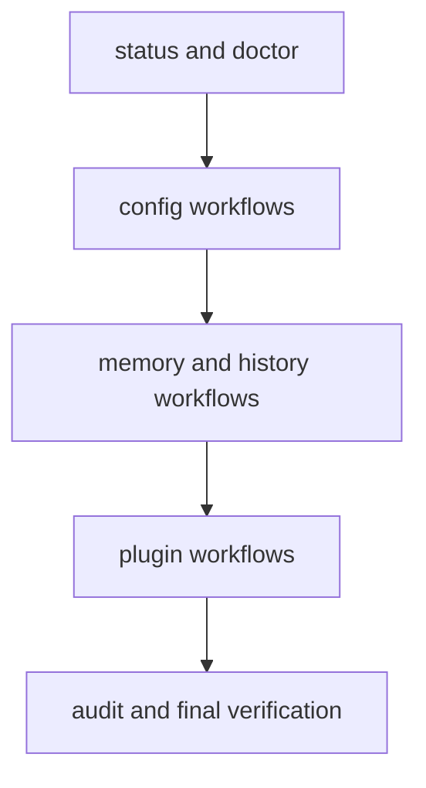

# Common Workflows

This page captures the most frequent runtime workflows used by operators and
maintainers in day-to-day CLI usage.

## Visual Summary



## Workflow Set

- runtime health: `status`, `doctor`, `audit`
- configuration: `config list/get/set/unset/export/load`
- memory state: `memory list/get/set/delete/clear`
- history management: `history --limit/--filter/--sort` and `history clear --force`
- plugin lifecycle: install, inspect, check, enable/disable, uninstall

## Example Session

```bash
bijux status --format json --no-pretty
bijux config set profile=dev
bijux memory set context=oncall
bijux history --limit 25 --sort timestamp
bijux plugins list
```

## Code Anchors

- `crates/bijux-cli/src/interface/cli/handlers/root.rs`
- `crates/bijux-cli/src/interface/cli/handlers/config.rs`
- `crates/bijux-cli/src/interface/cli/handlers/memory.rs`
- `crates/bijux-cli/src/interface/cli/handlers/history.rs`
- `crates/bijux-cli/src/interface/cli/handlers/plugins.rs`

## Workflow Rules

- prefer explicit options over implicit defaults in automation
- validate plugin health after each lifecycle mutation
- keep state changes observable with status and diagnostics checks

## Next Reads

- [Observability and Diagnostics](observability-and-diagnostics.md)
- [Operator Workflows](../interfaces/operator-workflows.md)
- [Review Checklist](../quality/review-checklist.md)
