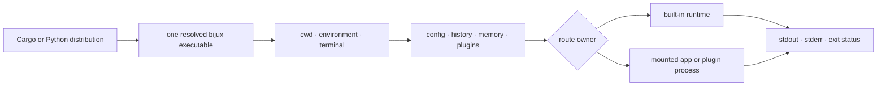

# Deployment Boundaries

`bijux` is a local process runtime. Deploying it means selecting one
distribution, one executable identity, explicit state roots, and the host
authority under which built-ins and delegated code run. The CLI does not
provide a daemon, remote control plane, or sandbox.

Two deployments with the same command arguments can behave differently when
their active binary, current directory, environment, state paths, plugin
registry, mounted applications, terminal mode, or filesystem permissions
differ.

## Deployment Topology

The route boundary matters most. A built-in handler stays inside the `bijux`
process. A mounted application or plugin transfers execution to another
program whose dependencies, resource use, and host effects remain its own.

## Ownership By Surface

| Surface | `bijux` owns | Deployment owns |
| --- | --- | --- |
| executable | version reporting and runtime compatibility | package pin, PATH order, upgrade and rollback |
| state paths | deterministic resolution and diagnostics | persistent storage, ownership, backup, and filesystem guarantees |
| project context | discovery and precedence behavior | working directory and checked-out project identity |
| structured output | envelope, stream placement, and exit meaning | capture, retention, parsing, and redaction |
| mounted application | discovery, delegation, and preserved child result | installation and health of the product binary |
| plugin | manifest/lifecycle validation and bounded direct-child execution | trust decision, code provenance, filesystem/network isolation |
| telemetry | opt-in bounded local records | sink retention, access, and sensitive-data handling |

## Acceptance Checklist

Before declaring a deployment ready:

1. identify the active executable with the host shell and `bijux version`;
2. record the installation channel and pinned version;
3. inspect `bijux cli paths --format json --no-pretty`;
4. validate the effective configuration from the workload directory;
5. run `bijux status` and the narrow diagnostics owned by required routes;
6. verify writable state locations using the same account as automation;
7. inspect every required mounted app or plugin independently;
8. capture a structured command result and its exit status through the actual
   automation wrapper.

Do not validate as one account and execute as another unless both identities,
homes, paths, and permissions are deliberately equivalent.

## Container And CI Environments

A container can make the executable and dependencies repeatable, but state
persists only when the selected paths are mounted or recreated deliberately.
An ephemeral home produces an empty configuration, history, memory, and plugin
registry on every start. A broad home-directory mount may expose far more data
to plugins than the workload requires.

For non-interactive execution:

- select an explicit output format instead of relying on terminal detection;
- set the working directory deliberately when project configuration matters;
- bind state paths to controlled storage;
- close or isolate credentials before invoking untrusted plugins;
- keep stdout, stderr, and exit status separate;
- do not assume the wrapper shell preserves the child's status unless tested.

## Diagnose Environment Drift

| Symptom | Compare |
| --- | --- |
| wrong version or behavior | resolved executable, package channel, and version |
| different effective value | working directory, config paths, profile, environment, and wrapper arguments |
| missing history or plugins | effective home and state mounts |
| human output where JSON was expected | TTY detection and explicit `--format` |
| route works interactively but not in CI | PATH, current directory, account, environment allowlist, and mounted state |
| delegated route alone fails | child executable identity, compatibility, streams, and exit status |
| plugin can access unexpected resources | host account/container authority; the CLI is not the isolation boundary |

## Implementation Anchors

- `crates/bijux-cli/src/interface/cli/dispatch/delegation.rs`
- `crates/bijux-cli/src/features/install/compatibility.rs`
- `crates/bijux-cli/src/features/install/paths.rs`
- `crates/bijux-cli/src/features/diagnostics/state_paths.rs`
- `crates/bijux-cli/src/shared/output.rs`

## Continue Reading

- [Installation And Setup](installation-and-setup.md)
- [Configuration Guide](../interfaces/config-guide.md)
- [State And Persistence](../architecture/state-and-persistence.md)
- [Security And Safety](security-and-safety.md)
- [Repository Fit](../foundation/repository-fit.md)
- [Integration Seams](../architecture/integration-seams.md)
