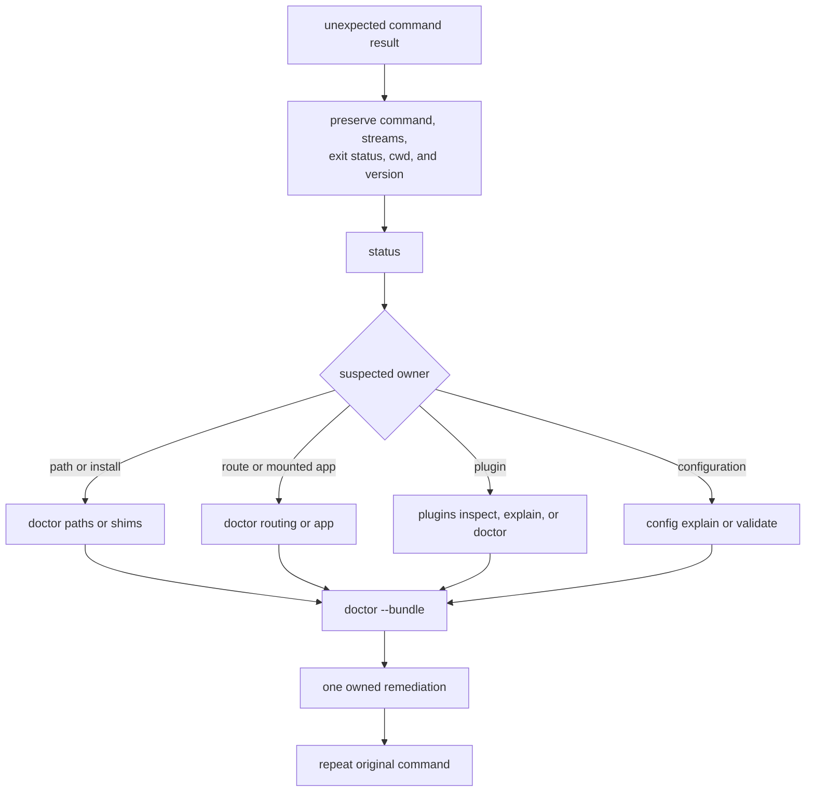

# Diagnostics Guide

Diagnostics are a product surface, not a collection of debug conveniences.
`status`, `doctor`, `audit`, plugin diagnostics, and bounded telemetry answer
different questions. A reliable investigation starts with the narrowest
surface that can confirm the suspected fault or produce evidence for the next
decision.

## Choose The Evidence Surface

| Command or surface | Best used for |
| --- | --- |
| `bijux status` | routine, machine-readable runtime and install health |
| `bijux doctor` | broad configuration, state, plugin, and install diagnosis |
| `bijux doctor paths` | wrong state, config, or plugin path resolution |
| `bijux doctor routing` | route inventory and dispatch confusion |
| `bijux doctor shims` | deprecated wrappers and `PATH` ambiguity |
| `bijux doctor python` | bridge availability and interpreter selection |
| `bijux doctor <app>` | health checks owned by one mounted application |
| `bijux plugins doctor` | plugin registry and lifecycle failures |
| `bijux plugins explain` | why a plugin was selected or rejected |
| `bijux audit` | consolidated check inventory and known issues |
| telemetry events | route flow and command completion timing |

Start with `status` for routine health checks. Move to `doctor` when the fault
involves configuration or environment state, and to the plugin-specific
commands when the evidence already points to plugin ownership. `audit` is an
inventory, not a substitute for a focused diagnosis.

Capture before broad diagnostics when plugin-registry corruption is plausible:
`status`, `audit`, and `doctor` can invoke state diagnostics that quarantine a
corrupt registry. The [Failure Recovery](failure-recovery.md) guide defines
that mutation boundary.

## Capture A Reproducible Bundle

`bijux doctor --bundle` writes evidence under
`./artifacts/bijux-cli/doctor-bundle` so a report can preserve the observed
state without relying on terminal history. The bundle contains:

- `doctor.json`
- `docs.json`
- `config/generated-reference.md`

Run the command again when configuration or installed components change. A
bundle is a snapshot, not a live view, and should be attached to a report with
the command that failed and the smallest reproducible input.

| Bundle item | Establishes | Does not establish |
| --- | --- | --- |
| `doctor.json` | post-diagnostic health observations and classifications | raw pre-diagnostic state or absence of side effects |
| `docs.json` | generated command/reference observations | that every documented workflow executed |
| `config/generated-reference.md` | configuration registry rendering | effective values or secret-safe deployment |

Record the bundle-producing command and exit status. Directory presence alone
does not prove a complete diagnostic run.

## Read Telemetry Conservatively

Telemetry can record invocation start and finish, route completion,
unknown-route suggestions, and bounded command or message fields. Its sink is
opt-in and intended for local diagnosis. It does not replace command results or
the evidence bundle.

Treat telemetry as potentially sensitive operational data:

- enable it only for a defined investigation
- keep recorded fields bounded rather than copying arbitrary payloads
- inspect the sink before sharing it outside the machine
- disable it after the investigation when continuous collection is unnecessary

Telemetry is ordered observation, not authority. If telemetry and the command
result disagree, preserve both and inspect the dispatch and write boundaries;
do not rewrite the command outcome from telemetry.

## Interpret Diagnostic Status

| Observation | Meaning | Next action |
| --- | --- | --- |
| healthy | selected checks found no owned defect | keep the scope narrow; this is not whole-system proof |
| degraded | operation remains available with a detected problem or repair | inspect every finding and preserved pre-repair state |
| failed | an owned check could not establish required health | route to the named owner before retry |
| unknown or incomplete | evidence was unavailable or unsupported | retain uncertainty; do not translate it to healthy |
| command and focused diagnostic disagree | scope, state, or timing differs | compare exact paths, inputs, and mutation chronology |

## Escalate Without Guessing

1. Re-run the failing command with the smallest input that still fails.
2. Capture `bijux status` and the relevant focused diagnostic command.
3. Use `bijux doctor --bundle` when the fault depends on machine state.
4. Record the expected result, observed result, CLI version, and exact command.
5. Preserve failing payloads and apply one remediation at a time.

Do not begin by deleting state broadly. If a claim cannot be checked through a
command result, `status`, `doctor`, `audit`, plugin diagnostics, or bounded
telemetry, identify that observability gap in the report rather than inventing
an explanation.

## Diagnostic Record

The investigation record remains useful after machine state changes only when
it binds the observation to its context:

| Field | Minimum content |
| --- | --- |
| invocation | exact argv, working directory, selected format, and whether the terminal was interactive |
| runtime | `bijux` version, installation path, Python interpreter when involved, and canonical route |
| state | active configuration, state, and plugin paths plus relevant lifecycle state |
| outcome | separate stdout, stderr, and exit status |
| diagnostic | exact focused command, bundle path, findings, and diagnostic exit status |
| chronology | observation before repair, one applied remediation, and repeated original invocation |
| confidentiality | redacted values and an explicit review of the bundle before sharing |

A post-repair healthy result does not erase the initial failure. Preserve both
observations and record the state transition that connects them.

## Implementation Ownership

- `crates/bijux-cli/src/features/diagnostics/` owns diagnostic behavior.
- `crates/bijux-cli/src/interface/cli/handlers/cli.rs` owns CLI presentation.
- `crates/bijux-cli/src/interface/cli/dispatch.rs` owns route dispatch.
- `crates/bijux-cli/src/shared/telemetry.rs` owns telemetry boundaries.

Changes to these surfaces must preserve structured output used by automation
and keep optional telemetry bounded. A regression that prevents operators from
producing reliable evidence is an operational defect, even if the underlying
command still completes.

## Related Operations

- [Failure Recovery](failure-recovery.md)
- [Security and Safety](security-and-safety.md)
- [Risk Register](../quality/risk-register.md)
