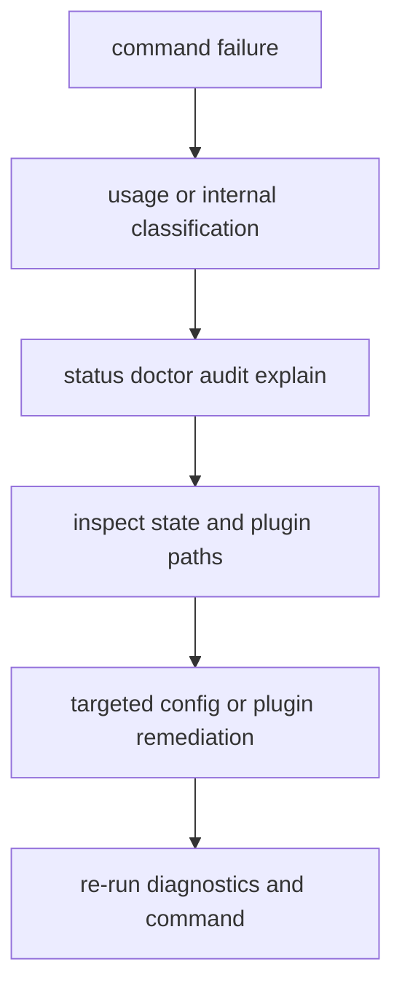

# Failure Recovery

Failure recovery for `bijux-cli` starts with deterministic diagnostics, explicit
state inspection, and safe command-level remediation.

## Visual Summary



## Recovery Workflow

1. Capture stderr payload and exit code.
2. Run `status`, `doctor`, and `audit` in structured mode.
3. Inspect state-path and plugin location reports.
4. Apply minimal remediation (`config`, `plugins`, `history`, `memory`).
5. Re-run the failing command and diagnostics checks.

## Recovery Commands

```bash
bijux status --format json --no-pretty
bijux doctor --format json --no-pretty
bijux audit --format json --no-pretty
bijux plugins doctor
bijux plugins explain
```

## Code Anchors

- `crates/bijux-cli/src/interface/cli/dispatch.rs`
- `crates/bijux-cli/src/interface/cli/handlers/cli.rs`
- `crates/bijux-cli/src/features/diagnostics/state_diagnostics.rs`
- `crates/bijux-cli/src/features/plugins/diagnostics.rs`

## Recovery Rules

- avoid broad state deletion without a bounded diagnosis
- preserve failing payloads for reproducible debugging
- apply one remediation step at a time for clear causality

## Next Reads

- [Observability and Diagnostics](observability-and-diagnostics.md)
- [Risk Register](../quality/risk-register.md)
- [Change Validation](../quality/change-validation.md)
