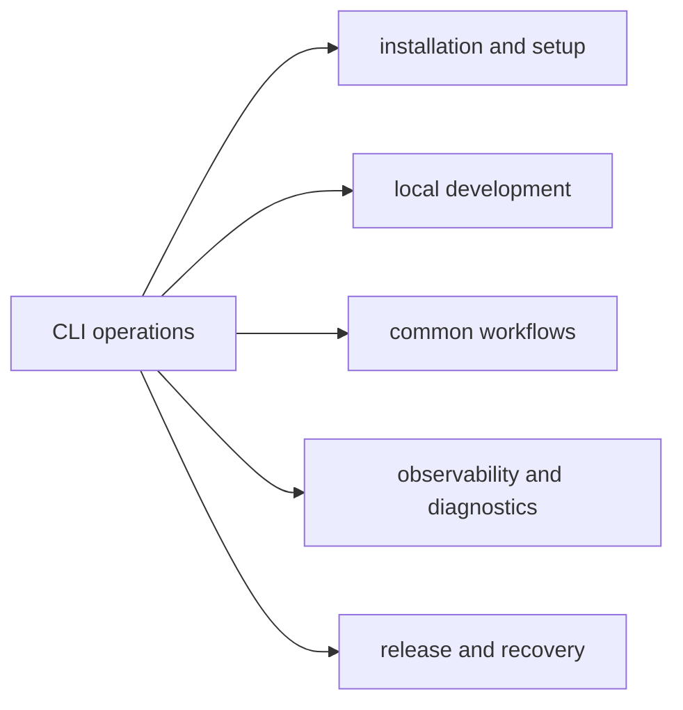

# CLI Operations

The operations section explains how to run, validate, diagnose, and release
`bijux-cli` in daily engineering and automation workflows.

## Section Map

## Operational Scope

- installation and first-run verification
- local build/test and command iteration loops
- day-to-day command workflows for operators
- diagnostics and telemetry collection patterns
- release, security, and deployment boundary practices

## Code Anchors

- `crates/bijux-cli/src/features/install/`
- `crates/bijux-cli/src/interface/cli/handlers/cli.rs`
- `crates/bijux-cli/src/shared/telemetry.rs`
- `crates/bijux-cli/tests/integration/`

## Pages In This Section

- [Installation and Setup](installation-and-setup.md)
- [Local Development](local-development.md)
- [Common Workflows](common-workflows.md)
- [Diagnostics Guide](diagnostics-guide.md)
- [Observability and Diagnostics](observability-and-diagnostics.md)
- [Performance and Scaling](performance-and-scaling.md)
- [Failure Recovery](failure-recovery.md)
- [Migration Guide](reference/migration-guide.md)
- [Release and Versioning](release-and-versioning.md)
- [Security and Safety](security-and-safety.md)
- [Deployment Boundaries](reference/deployment-boundaries.md)

## Reading Rule

Use this section when the question is about running or supporting the CLI in
practice. Move back to Interfaces when the next question is about stable caller
contracts instead of operating behavior.
