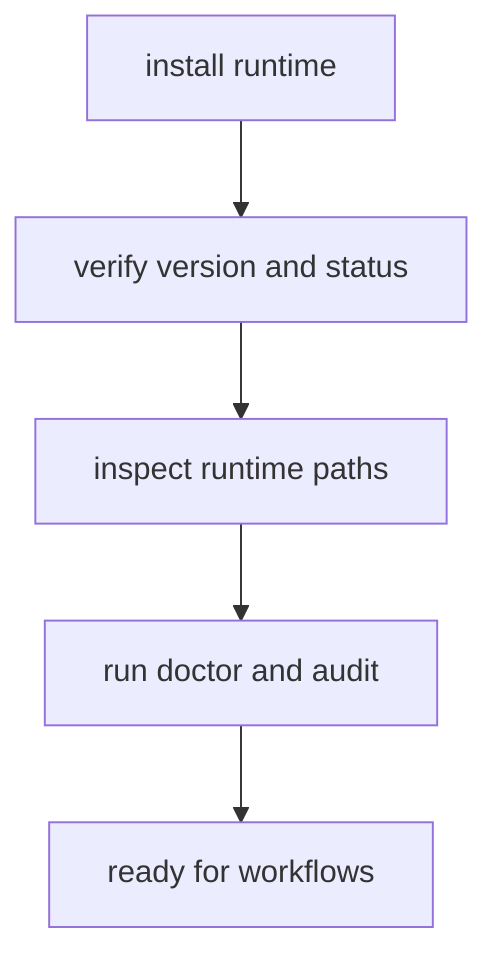

# Installation and Setup

Installation should produce one clear runtime binary, stable state paths, and a
verifiable command surface before workflow automation begins.

## Visual Summary



## Setup Checklist

1. Install the runtime from the chosen channel.
2. Confirm active binary and version identity.
3. Verify resolved state paths and plugin registry location.
4. Run diagnostics commands before script usage.

## Baseline Commands

```bash
bijux version
bijux status --format json --no-pretty
bijux cli paths
bijux doctor
bijux audit
```

## Code Anchors

- `crates/bijux-cli/src/features/install/diagnostics.rs`
- `crates/bijux-cli/src/features/install/query.rs`
- `crates/bijux-cli/src/interface/cli/handlers/cli.rs`
- `crates/bijux-cli/src/features/diagnostics/state_paths.rs`

## Setup Rules

- avoid multiple active binaries on `PATH`
- keep `status` and `doctor` clean before onboarding automation
- treat path-shadowing warnings as setup failures until resolved

## Next Reads

- [Local Development](local-development.md)
- [Failure Recovery](failure-recovery.md)
- [Security and Safety](security-and-safety.md)
