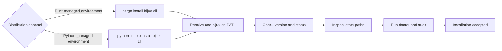

# Installation and Setup

An accepted `bijux` installation has one intended executable, a known
distribution owner, visible state locations, and clean runtime diagnostics.
Finding a command on `PATH` establishes none of those properties by itself.

## Choose A Distribution

Both supported channels install the `bijux` command and target the same public
runtime contract. Choose one channel per environment so executable resolution
is unambiguous.

| Channel | Install | Choose it when | Additional boundary |
| --- | --- | --- | --- |
| Rust crate | `cargo install bijux-cli` | the environment already manages Rust-installed binaries | does not install Python package APIs |
| Python package | `python -m pip install bijux-cli` | the environment manages applications in Python or needs `bijux_cli_py` | requires Python 3.11 or newer; does not install `bijux-dag` |



The PyPI distribution is not a second command implementation. Its launcher,
native bridge, and fallback facade remain governed against the
`bijux-cli` command contract. Install `bijux-dag-cli` separately when DAG
workflows are required.

## Setup Checklist

1. Install the runtime from the chosen channel.
2. Confirm active binary and version identity.
3. Verify resolved state paths and plugin registry location.
4. Run diagnostics commands before script usage.

## Baseline Commands

```bash
bijux version
bijux status --format json --no-pretty
bijux cli paths
bijux doctor
bijux audit
```

When Python APIs are part of the deployment, also verify the module entrypoint:

```bash
python -m bijux_cli_py --help
bijux doctor python
```

## Installation Acceptance

| Check | Accepted evidence | Failure owner |
| --- | --- | --- |
| `bijux version` | reported version matches the selected Cargo or Python installation | executable resolution or package ownership |
| `bijux status` | runtime identity, state, and extension context are internally coherent | runtime or selected state root |
| `bijux cli paths` | config, history, memory, and plugin locations match the intended account and environment | path precedence or environment |
| `bijux doctor` | installation, configuration, bridge, routing, and extension checks have no unresolved required finding | the named diagnostic component |
| `bijux audit` | no reported operational finding remains unreviewed | runtime, state, plugin, or policy owner identified by the finding |

## Resolve Multiple Installations

If the reported executable or version is unexpected:

1. inspect every `bijux` candidate on `PATH` using the host shell's command
   lookup;
2. identify whether Cargo, a virtual environment, a user-level Python install,
   or a system package owns each candidate;
3. remove or deactivate unintended candidates rather than relying on PATH
   order by accident;
4. open a new shell and rerun the baseline commands;
5. verify automation with the same environment and account that will execute
   it.

Do not repair shadowing by copying binaries between package-manager
directories. That breaks upgrade ownership and makes the active version harder
to audit.

## Code Anchors

- `crates/bijux-cli/src/features/install/diagnostics.rs`
- `crates/bijux-cli/src/features/install/query.rs`
- `crates/bijux-cli/src/interface/cli/handlers/cli.rs`
- `crates/bijux-cli/src/features/diagnostics/state_paths.rs`

## Setup Rules

- avoid multiple active binaries on `PATH`
- keep `status` and `doctor` clean before onboarding automation
- treat path-shadowing warnings as setup failures until resolved
- pin a release through the chosen package manager when reproducibility matters
- record the distribution and command version in deployment evidence

If `bijux` executes but cannot explain its binary identity, paths, or state,
the installation remains ambiguous and should not be promoted into automation.

## Operate And Recover

- [Local Development](local-development.md)
- [Failure Recovery](failure-recovery.md)
- [Security and Safety](security-and-safety.md)
- [Python Package](../packages/bijux-cli-python.md)
