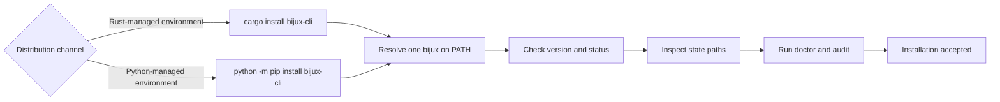

# Installation and Setup

Use this page when you need to install `bijux` and prove that the binary,
resolved paths, and diagnostics surfaces are trustworthy before any automation
or daily usage begins.

A good setup result is not just "the command exists on PATH." It means one
clear runtime binary is active, state locations are visible, and the CLI can
describe its own health without ambiguity.

## Choose A Distribution

Both supported channels install the `bijux` command and target the same public
runtime contract. Choose one channel per environment so executable resolution
is unambiguous.

| Channel | Install | Choose it when | Additional boundary |
| --- | --- | --- | --- |
| Rust crate | `cargo install bijux-cli` | the environment already manages Rust-installed binaries | does not install Python package APIs |
| Python package | `python -m pip install bijux-cli` | the environment manages applications in Python or needs `bijux_cli_py` | requires Python 3.11 or newer; does not install `bijux-dag` |



The PyPI distribution is not a second command implementation. Its launcher,
native bridge, and fallback facade remain governed against the
`bijux-cli` command contract. Install `bijux-dag-cli` separately when DAG
workflows are required.

## Setup Checklist

1. Install the runtime from the chosen channel.
2. Confirm active binary and version identity.
3. Verify resolved state paths and plugin registry location.
4. Run diagnostics commands before script usage.

## Baseline Commands

```bash
bijux version
bijux status --format json --no-pretty
bijux cli paths
bijux doctor
bijux audit
```

When Python APIs are part of the deployment, also verify the module entrypoint:

```bash
python -m bijux_cli_py --help
bijux doctor python
```

## What These Checks Should Tell You

| Check | What it should confirm |
| --- | --- |
| `bijux version` | the invoked binary is the one you expect to trust |
| `bijux status` | runtime identity, state, and plugin context look sane |
| `bijux cli paths` | config, state, and plugin directories resolve where you think they do |
| `bijux doctor` | install, config, bridge, and routing health are coherent |
| `bijux audit` | the CLI is not already reporting known operational problems |

## Resolve Multiple Installations

If the reported executable or version is unexpected:

1. inspect every `bijux` candidate on `PATH` using the host shell's command
   lookup;
2. identify whether Cargo, a virtual environment, a user-level Python install,
   or a system package owns each candidate;
3. remove or deactivate unintended candidates rather than relying on PATH
   order by accident;
4. open a new shell and rerun the baseline commands;
5. verify automation with the same environment and account that will execute
   it.

Do not repair shadowing by copying binaries between package-manager
directories. That breaks upgrade ownership and makes the active version harder
to audit.

## Code Anchors

- `crates/bijux-cli/src/features/install/diagnostics.rs`
- `crates/bijux-cli/src/features/install/query.rs`
- `crates/bijux-cli/src/interface/cli/handlers/cli.rs`
- `crates/bijux-cli/src/features/diagnostics/state_paths.rs`

## Setup Rules

- avoid multiple active binaries on `PATH`
- keep `status` and `doctor` clean before onboarding automation
- treat path-shadowing warnings as setup failures until resolved
- pin a release through the chosen package manager when reproducibility matters
- record the distribution and command version in deployment evidence

## Reader Shortcut

If `bijux` works only until you ask it where its state lives or which binary is
active, the installation is not complete. Diagnose setup first, then automate.

## Continue Reading

- [Local Development](local-development.md)
- [Failure Recovery](failure-recovery.md)
- [Security and Safety](security-and-safety.md)
- [Python Package](../packages/bijux-cli-python.md)
