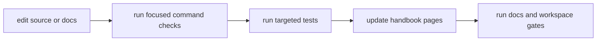

# Local Development

Local development for `bijux-cli` should combine fast command iteration with
targeted test evidence on every contract-impacting change.

## Visual Summary



## Local Development Loop

- run command behavior locally through `cargo run -p bijux-cli --bin bijux -- ...`
- run focused tests in affected routing, integration, or architecture suites
- update handbook pages when user-facing behavior changes
- rerun docs and contract checks before commit

## Typical Commands

```bash
cargo run -p bijux-cli --bin bijux -- status
cargo test -p bijux-cli routing::
cargo test -p bijux-cli integration::
make docs-check
```

## Code Anchors

- `crates/bijux-cli/tests/routing/`
- `crates/bijux-cli/tests/integration/`
- `crates/bijux-cli/tests/architecture/`
- `makes/docs.mk`

## Development Rules

- treat golden/snapshot changes as reviewable contract changes
- avoid mixing unrelated behavior and documentation edits in one commit
- keep commits scoped to one understandable runtime concern

## Next Reads

- [Common Workflows](common-workflows.md)
- [Test Strategy](../quality/test-strategy.md)
- [Change Validation](../quality/change-validation.md)
