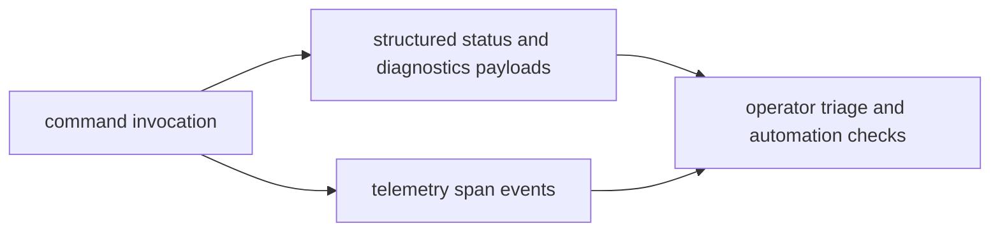

# Observability and Diagnostics

`bijux-cli` observability combines structured command payloads, diagnostics
commands, and optional telemetry event streams for traceability.

## Visual Summary

## Diagnostic Surfaces

- `status`: runtime, state, plugins, and install summary
- `doctor`: configuration, install, state, and plugin health checks
- `audit`: consolidated check inventory and issues
- `plugins doctor` and `plugins explain`: plugin-specific diagnostics

## Telemetry Surface

- invocation start/finish events
- route completion and unknown-route suggestion events
- bounded command and message field recording
- opt-in sink configuration for local diagnostics

## Code Anchors

- `crates/bijux-cli/src/interface/cli/dispatch.rs`
- `crates/bijux-cli/src/shared/telemetry.rs`
- `crates/bijux-cli/src/features/diagnostics/`
- `crates/bijux-cli/src/interface/cli/handlers/cli.rs`

## Diagnostics Rules

- prefer machine-readable output for automation and CI checks
- keep telemetry optional and bounded to avoid leaking oversized data
- treat diagnostics regressions as operational blockers

## Next Reads

- [Failure Recovery](failure-recovery.md)
- [Risk Register](../quality/risk-register.md)
- [Security and Safety](security-and-safety.md)
