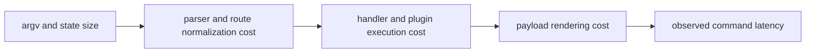

# Performance and Scaling

`bijux-cli` performance work focuses on predictable command latency,
bounded-memory parsing/rendering, and reliable behavior as plugin/state
inventories grow.

## Visual Summary

## Performance Hotspots

- parser normalization over large argument vectors
- plugin registry discovery and health checks
- history and memory file scanning for large local state files
- rendering very large structured payloads
- delegated command invocation overhead

## Code Anchors

- `crates/bijux-cli/src/routing/parser.rs`
- `crates/bijux-cli/src/features/plugins/discovery.rs`
- `crates/bijux-cli/src/features/history/operations.rs`
- `crates/bijux-cli/src/shared/output.rs`
- `crates/bijux-cli/src/interface/repl/`

## Scaling Rules

- keep telemetry fields bounded and truncation-aware
- separate slow integration contracts from default fast test gates
- avoid unbounded data joins in diagnostics payloads
- prefer streaming or targeted queries for large state files

## Next Reads

- [Test Strategy](../quality/test-strategy.md)
- [Known Limitations](../quality/known-limitations.md)
- [Architecture Risks](../architecture/architecture-risks.md)
