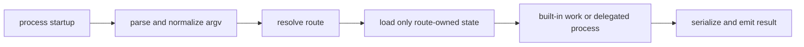

# Performance and Scaling

Use this page when the CLI feels correct but too slow, too heavy, or too
fragile under larger local state and plugin inventories.

Performance in `bijux-cli` is about predictable latency and bounded behavior,
not peak throughput. An operator should be able to identify which input grew,
which owner consumed the time or memory, and whether the observed behavior is
a product regression, delegated work, or an environment effect.

## Cost Model



| Cost center | Growth variable | Expected containment |
| --- | --- | --- |
| parsing and suggestions | argument count, token length, candidate routes | bounded suggestions; no state scan before ownership is known |
| configuration | selected file and layer sizes | only configuration commands pay configuration inspection cost |
| plugin registry | installed record count and manifest health | unrelated built-ins do not scale with registry size |
| history and memory | record count and serialized bytes | limits bound output, but current file-backed reads may still inspect the stored collection |
| delegated execution | child startup and child workload | native child streams and exit status make ownership visible |
| rendering | selected records and payload size | compact structured output reduces presentation overhead but not source work |

Route isolation is a performance invariant. A large plugin registry must not
make an unrelated configuration or history command traverse plugin state.

## Measure Before Changing

Capture the command, output format, exit status, and environment separately
from timing:

```bash
mkdir -p artifacts
/usr/bin/time -p -o artifacts/status.time \
  bijux status --format json --no-pretty \
  >artifacts/status.json \
  2>artifacts/status.stderr
printf '%s\n' "$?" >artifacts/status.exit
```

For a state-dependent command, repeat against an explicit copied state path so
the workload is stable and the original file is not mutated. Record:

- `bijux version --format json --no-pretty`;
- operating system, architecture, storage type, and whether stdout is a TTY;
- relevant state-file byte size and record count;
- plugin count for plugin commands;
- output format and output byte size;
- warm-up policy, number of samples, and a distribution such as median and
  high percentile rather than only the fastest result.

Do not compare an in-process call with a fresh binary invocation, a warm
filesystem cache with a cold one, or a built-in command with delegated process
startup.

## Regression Evidence

`performance_realism_hardening.rs` exercises fresh-process startup for key
commands, stressed plugin/config/history states, output-size budgets, and
route isolation. These checks are guardrails for repository regressions. Their
wall-clock budgets include deliberate headroom for CI variation and are not a
public latency service-level objective.

The DAG performance registry under `evidence/dag/perf/` governs DAG scenarios;
it must not be cited as evidence for root CLI startup without a CLI-specific
scenario and measurement.

## Diagnosis

| Observation | First comparison | Likely owner |
| --- | --- | --- |
| every command regressed | `version` versus `status` in the same environment | process startup, binary loading, or shared dispatch |
| only plugin commands regress with inventory | empty versus representative registry | plugin discovery or manifest validation |
| unrelated commands regress with plugin inventory | same command with an empty and large registry | route-isolation defect |
| history remains slow with a small output limit | small versus large source file at the same limit | history storage/read path |
| JSON is slow but work is unchanged | compact JSON versus text and output bytes | serialization or emission |
| only a mounted app or plugin is slow | child timing and native exit evidence | delegated product or plugin |
| high variance without workload changes | repeated samples plus storage and system-load context | measurement environment |

## Code Anchors

- `crates/bijux-cli/src/routing/parser.rs`
- `crates/bijux-cli/src/features/plugins/discovery.rs`
- `crates/bijux-cli/src/features/history/operations.rs`
- `crates/bijux-cli/src/shared/output.rs`
- `crates/bijux-cli/src/interface/repl/`
- `crates/bijux-cli/tests/integration/cli/resilience/performance_realism_hardening.rs`

## Acceptance Rules

- preserve route, output, exit, and mutation semantics before comparing speed;
- reject optimizations that skip compatibility, integrity, redaction, or
  lifecycle checks;
- keep telemetry fields and diagnostic suggestions bounded;
- treat payload size and retained-state size as separate variables;
- add a representative regression case when a fixed cost or growth behavior
  becomes a product expectation;
- state the measured workload and environment; do not generalize one local
  result into a universal capacity claim.

## Continue Reading

- [Test Strategy](../quality/test-strategy.md)
- [Known Limitations](../quality/known-limitations.md)
- [Architecture Risks](../architecture/architecture-risks.md)
