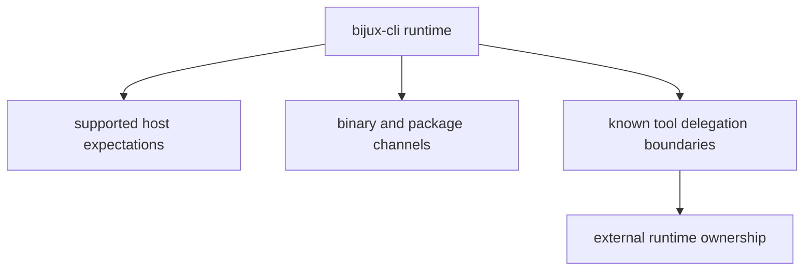

# Deployment Boundaries

Deployment boundaries clarify what `bijux-cli` can guarantee in different host
and packaging contexts, and where responsibility shifts to adjacent tooling.

## Visual Summary

## Boundary Areas

- host environment assumptions for command and completion behavior
- package/channel alignment for runtime version identity
- delegated known-tool route handoff boundaries
- state directory and plugin path ownership boundaries

## Code Anchors

- `crates/bijux-cli/src/interface/cli/dispatch/delegation.rs`
- `crates/bijux-cli/src/features/install/compatibility.rs`
- `crates/bijux-cli/src/features/install/paths.rs`
- `crates/bijux-cli/src/features/diagnostics/state_paths.rs`

## Boundary Rules

- document host limitations clearly and keep them current
- treat delegated-route failures as observable operational errors
- avoid implicit cross-package assumptions in CLI-only release notes

## Next Reads

- [Repository Fit](../../foundation/repository-fit.md)
- [Integration Seams](../../architecture/integration-seams.md)
- [Risk Register](../../quality/risk-register.md)
