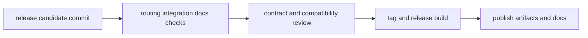

# Release and Versioning

Release and versioning practices for `bijux-cli` require command-contract
stability checks, explicit compatibility review, and reproducible build identity.

## Visual Summary

## Release Requirements

- green CLI routing, integration, and architecture suites
- updated docs for any command-surface or output-contract changes
- compatibility notes for parser, route, or contract shape updates
- validated runtime version identity in release outputs

## Code Anchors

- `crates/bijux-cli/build.rs`
- `crates/bijux-cli/src/shared/version.rs`
- `crates/bijux-cli/src/api/version.rs`
- `crates/bijux-cli/tests/architecture/ownership/release_tree_contracts.rs`
- `makes/docs.mk`

## Versioning Rules

- treat output and command grammar changes as versioning-significant
- keep semver and release tags aligned with shipped contract behavior
- avoid undocumented behavior changes between patch releases

## Current Release Line

- release target: `v0.4.0`
- published Rust crate: `bijux-cli`
- published Python package: `bijux-cli`
- DAG companion product now publishes its Rust crate family on the same release line from the shared repository.

## Next Reads

- [Compatibility Commitments](../interfaces/compatibility-commitments.md)
- [Definition of Done](../quality/definition-of-done.md)
- [Change Validation](../quality/change-validation.md)
