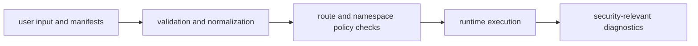

# Security and Safety

`bijux-cli` security posture is centered on explicit trust boundaries, safe
configuration handling, and transparent plugin lifecycle controls.

## Visual Summary

## Safety Boundaries

- plugin installation is a trust decision, not a sandbox guarantee
- reserved namespaces prevent extension collisions with core/runtime roots
- config values are validated for ASCII and control-character safety
- diagnostics surface path conflicts and plugin health warnings

## Code Anchors

- `crates/bijux-cli/src/contracts/plugin.rs`
- `crates/bijux-cli/src/routing/registry.rs`
- `crates/bijux-cli/src/contracts/config.rs`
- `crates/bijux-cli/src/features/plugins/operations.rs`
- `crates/bijux-cli/src/interface/cli/handlers/cli.rs`

## Safety Rules

- do not auto-trust external plugin manifests
- keep plugin trust and compatibility metadata visible in reports
- fail explicitly on invalid config and namespace conflicts
- keep diagnostics available for operator safety triage

## Next Reads

- [Extensibility Model](../architecture/extensibility-model.md)
- [Failure Recovery](failure-recovery.md)
- [Known Limitations](../quality/known-limitations.md)
