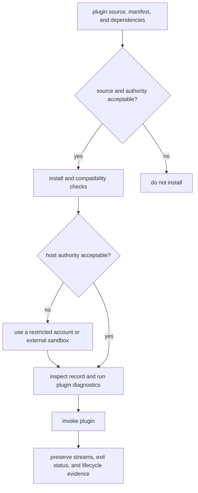

# Security and Safety

`bijux-cli` validates extension metadata and limits how plugin processes are
started. It does not isolate plugin code from the current user account.

Installing or invoking a plugin is therefore a code-execution decision. Review
the manifest, entrypoint, and dependency source with the same care as a script
you would run directly.

The restricted environment in this flow is supplied by the operating system
or deployment platform. It is not created by `bijux`.

## Threat Boundary

| Concern | Enforced by the CLI | Not enforced by the CLI |
| --- | --- | --- |
| command ownership | reserved, core, product, and known-tool namespaces cannot be claimed by a plugin | a permitted namespace does not establish publisher identity |
| host compatibility | manifest version ranges are parsed and checked before installation and enablement | compatibility metadata does not prove behavioral compatibility |
| lifecycle | disabled, broken, and incompatible records are refused at execution | enabled does not mean safe |
| process duration | timeout defaults to 30 seconds and is clamped to 1-600 seconds | timeout is not a CPU, memory, or child-process quota |
| process environment | the parent environment is cleared before an allowlisted environment is rebuilt | `BIJUX_*` and `PYTHON*` variables are forwarded and may contain sensitive values |
| process authority | standard input is closed and output is captured | filesystem, network, credentials, and OS permissions are not sandboxed |
| configuration output | secret-like values are redacted by default in layered reports | `--include-secrets` deliberately reveals those values |
| manifest integrity | the registry records a SHA-256 checksum of the manifest | the checksum is not a signature and does not attest entrypoint code or dependencies |

## Plugin Process Policy

Python and external-executable plugins run as child processes with the current
user's identity. The launcher:

- clears the inherited environment
- restores host path, home, user, shell, temporary-directory, locale, and
  Windows process variables when present
- forwards every variable whose name starts with `BIJUX_` or `PYTHON`
- closes standard input
- captures standard output and standard error
- terminates the direct child when the timeout expires and returns exit code
  `124`

Set `BIJUX_PLUGIN_TIMEOUT_SECONDS` only to a value appropriate for the
entrypoint. Values below 1 second become 1; values above 600 become 600.
Timeout protects the caller from an indefinitely waiting direct child. It does
not establish containment for subprocess trees created by a plugin.

The Python bridge requires Python 3.11 or newer and inserts the installed
manifest root at the front of `sys.path`. That makes the selected plugin source
authoritative for its imported module; it is another reason to verify the
installed source path.

## Configuration And Secrets

Configuration keys are normalized to ASCII identifiers. Values reject
non-ASCII text and control characters before storage. These checks protect the
configuration format and terminal-facing output; they are not content
sanitization for a downstream plugin.

Layered config reports treat schema-marked fields and names containing
`secret`, `token`, `password`, `credential`, `apikey`, `api_key`, or
`private_key` as secret-like. `config explain`, `config diff`, and layered
reports replace their values with `[redacted]` unless `--include-secrets` is
present.

Redaction protects display, not storage or process access. Before invoking an
untrusted plugin:

1. Remove credentials from `BIJUX_*` and `PYTHON*` environment variables.
2. Use an operating-system account or container with only the required files
   and network access.
3. Inspect the canonical manifest path, source, trust level, lifecycle state,
   and checksum with the plugin inspection commands.
4. Run plugin diagnostics after changing the CLI version or plugin files.
5. Do not publish command output produced with `--include-secrets`.

## Evidence To Preserve

| Evidence | Why it matters | Caution |
| --- | --- | --- |
| `plugins inspect` structured output | records identity, source, compatibility, lifecycle, and manifest checksum | checksum covers the manifest, not all executable content |
| `plugins doctor` structured output | records registry-wide health at investigation time | health is not a trust attestation |
| canonical manifest and entrypoint paths | identifies the code selected by the runtime | a path may point into mutable content |
| stdout, stderr, and exit status | preserves the delegated process outcome | keep streams separate |
| relevant environment variable names | identifies possible credential paths | redact values before sharing |
| CLI and Python versions | makes compatibility findings reproducible | version agreement does not prove safety |

## Incident Response

Disable a suspect plugin before investigation. Disabling preserves its record
for inspection while preventing route execution. Capture the manifest,
recorded checksum, source path, lifecycle report, and diagnostics before
changing files. Uninstall only after preserving the evidence you need.

If a plugin process may have accessed credentials, treat those credentials as
exposed. CLI lifecycle state cannot revoke tokens or undo filesystem and
network access granted by the host account.

After containment, verify that the disabled route is no longer executable,
rotate exposed credentials outside the CLI, inspect files and network systems
available to the host account, and retain the investigation evidence before
uninstalling the plugin.

## Implementation Map

- `crates/bijux-cli/src/features/plugins/manifest.rs` validates identity,
  compatibility, namespace, and entrypoint declarations.
- `crates/bijux-cli/src/features/plugins/runtime.rs` defines process
  environment and timeout policy.
- `crates/bijux-cli/src/features/plugins/operations.rs` exposes inspection,
  diagnostics, enablement, disablement, and uninstall behavior.
- `crates/bijux-cli/src/features/config/schema.rs` identifies secret-like keys
  and applies output redaction.
- `crates/bijux-cli/src/features/config/layered.rs` carries redaction through
  layered reports.

## Continue Reading

- [Extensibility Model](../architecture/extensibility-model.md)
- [Failure Recovery](failure-recovery.md)
- [Known Limitations](../quality/known-limitations.md)
