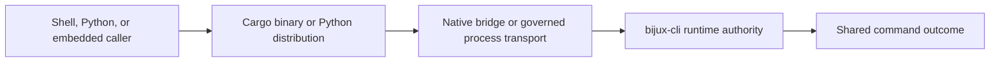

# CLI Packages

Use this page when you already know the question belongs to `bijux`, but you
still need the correct package boundary.

`bijux-cli` holds native command behavior. `bijux-cli-python` carries the
Python distribution surface and bridge back into the same runtime contract.

Start here when you are deciding whether a change belongs to the runtime
itself, the Python launcher and wheel distribution, or both.

Distribution and transport can vary. Parsing, route behavior, state semantics,
output meaning, and exit behavior remain owned by `bijux-cli`.

## Choose The Owning Package

| Package | Owns | Enter Here When |
| --- | --- | --- |
| [`bijux-cli`](bijux-cli.md) | Native runtime semantics, command routing, executable behavior, and contract-facing CLI surfaces | the issue is flags, output shape, exit behavior, routing, or runtime execution semantics |
| [`bijux-cli-python`](bijux-cli-python.md) | Python distribution surface, launcher bridge behavior, packaging metadata, and cross-language runtime parity | the issue is Python install/entrypoint behavior, bridge compatibility, or release packaging alignment |

## The Split In Plain Terms

- `bijux-cli` is the source of truth for what the command runtime does.
- `bijux-cli-python` is the distribution and bridge layer for Python callers.
- Both should tell the same runtime story. If they disagree, the problem is a
  parity defect, not two different products.

## Cross-Package Contract

| Surface | Native authority | Python responsibility |
| --- | --- | --- |
| command tree | `bijux-cli` routing catalog and inspection API | query or transport it without maintaining a copy |
| execution | `bijux-cli::api::runtime` | invoke through PyO3 or resolved process fallback |
| config and plugin paths | native precedence contracts | expose equivalent helper results |
| errors | runtime outcome and exit semantics | map to Python exceptions without losing diagnostics |
| mounted Python apps | root mount and envelope contracts | callable, interpreter, descriptor, and packaging adaptation |
| installation | Cargo package and release binary | wheel, console entrypoint, native extension, and platform diagnostics |

The Python process fallback is a compatibility transport, not permission to
reimplement command semantics. Installing `bijux-cli-python` also does not
install or embed the separate `bijux-dag` runtime.

## Common Routing Decisions

| Situation | Start here |
| --- | --- |
| the binary parses or renders something incorrectly | [`bijux-cli`](bijux-cli.md) |
| a PyPI install launches the wrong thing or fails environment checks | [`bijux-cli-python`](bijux-cli-python.md) |
| a mounted Python app behaves differently from the native runtime | [`bijux-cli-python`](bijux-cli-python.md) |
| you need the public command contract before picking a crate | [CLI Interfaces](../interfaces/index.md) |

## Changes That Require Both Packages

- runtime outcome or error-envelope changes;
- exported bridge method or conversion changes;
- command-tree inspection changes consumed by Python;
- config, history, plugin, or install path precedence changes;
- Python-supported host version and compatibility changes;
- release version or packaging changes that claim cross-language parity.

For these changes, native tests establish behavior and bridge/process parity
tests establish transport equivalence. One package suite cannot substitute for
the other.

## Before You Move Deeper

- Stay here until you know the first durable owner.
- If a change crosses both packages, treat it as an explicit parity or release
  boundary change and review both package pages before implementation.
- Move back to the CLI handbook when the question is product behavior rather
  than crate ownership.
