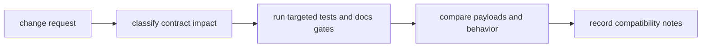

# Change Validation

Change validation is the minimum evidence package required before merging a
`bijux-cli` behavior change.

## Visual Summary



## Validation Checklist

1. classify whether command grammar, output, or exit semantics changed
2. execute targeted routing and integration suites
3. run architecture boundary tests when module ownership shifts
4. verify docs structure and handbook consistency
5. include explicit compatibility notes when callers may be affected

## Validation Commands

```bash
cargo test -p bijux-cli routing::
cargo test -p bijux-cli integration::
cargo test -p bijux-cli architecture::
make docs-check
```

## Code Anchors

- `crates/bijux-cli/tests/routing/`
- `crates/bijux-cli/tests/integration/`
- `crates/bijux-cli/tests/architecture/`
- `makes/docs.mk`

## Next Reads

- [Definition of Done](definition-of-done.md)
- [Compatibility Commitments](../interfaces/compatibility-commitments.md)
- [Test Strategy](test-strategy.md)
