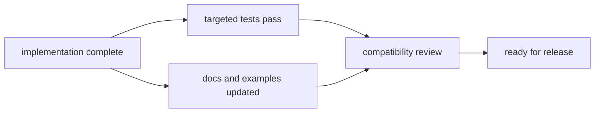

# Definition of Done

This page explains when a CLI change is actually ready to leave review.

The line between "implemented" and "done" matters here. A change is only done
when the behavior, proof, and written contract all point at the same result.

## Done Flow

## Done Criteria

- behavior change is implemented in the owning module
- relevant routing/integration/architecture tests are updated and passing
- affected handbook pages are updated with concrete code anchors and diagrams
- compatibility impact is explicitly documented when contract-facing
- no unresolved blocking risk remains in the review thread

## Code Anchors

- `crates/bijux-cli/src/`
- `crates/bijux-cli/tests/`
- `docs/bijux-cli/`
- `makes/docs.mk`

## Not Done Signals

- docs still describe old behavior
- tests are missing for contract-impacting changes
- compatibility risk is implied but not stated
- review checklist items are skipped without rationale

## Reading Rule

Use this page when a change feels nearly finished but the review still needs a
clear stop-or-go rule.

## Next Reads

- [Review Checklist](review-checklist.md)
- [Change Validation](change-validation.md)
- [Release and Versioning](../operations/release-and-versioning.md)
