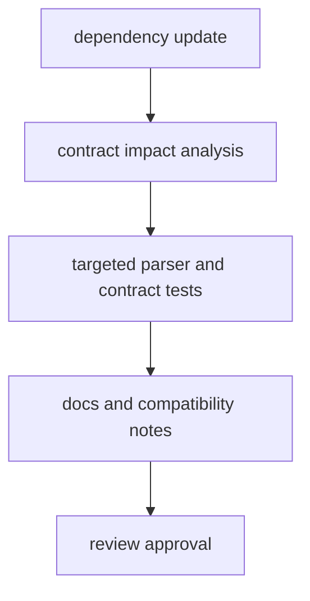

# Dependency Governance

Dependency governance ensures `bijux-cli` remains predictable when parser,
serialization, schema, and semver libraries evolve.

## Visual Summary

## Governance Focus

- parser grammar and help behavior (`clap`)
- payload and schema serialization (`serde`, `serde_json`, `schemars`)
- compatibility range semantics (`semver`)
- error typing and propagation (`thiserror`, `anyhow`)

## Code Anchors

- `crates/bijux-cli/Cargo.toml`
- `crates/bijux-cli/src/routing/parser.rs`
- `crates/bijux-cli/src/contracts/schema.rs`
- `crates/bijux-cli/src/contracts/plugin.rs`
- `crates/bijux-cli/tests/routing/`

## Governance Rules

- no dependency bumps without targeted test evidence
- document behavior changes caused by dependency upgrades
- avoid broad upgrade bundles that hide root-cause regressions
- keep dependency decisions auditable in commit and review history

## Next Reads

- [Dependencies and Adjacencies](../foundation/dependencies-and-adjacencies.md)
- [Change Validation](change-validation.md)
- [Risk Register](risk-register.md)
