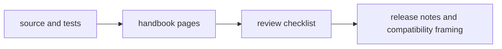

# Documentation Standards

CLI documentation is treated as part of the contract surface, not optional
after-the-fact commentary.

## Visual Summary

## Standards

- every page must include frontmatter with owner and last review date
- every page must include at least one Mermaid diagram
- every page must include concrete code anchors
- page claims must map to currently shipped behavior
- cross-links should point to canonical handbook pages only

## CLI Handbook Shape Standard

- package root index plus five section directories
- ten pages in each section
- no nested section trees under `docs/bijux-cli/`

## Migration Coverage Standard

Legacy chapter themes remain represented through current pages:

- introduction and getting-started material maps into foundation and operations
- reference and contracts material maps into interfaces and quality
- development and architecture material maps into architecture and quality

## Code Anchors

- `mkdocs.yml`
- `makes/docs.mk`
- `docs/bijux-cli/`

## Next Reads

- [Review Checklist](review-checklist.md)
- [Change Principles](../foundation/change-principles.md)
- [Release and Versioning](../operations/release-and-versioning.md)
