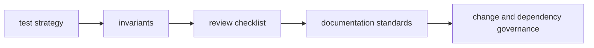

# CLI Quality

The quality section defines how `bijux-cli` changes are validated, reviewed, and
documented before release.

## Visual Summary

## Quality Scope

- test layering and execution expectations
- invariant checks that protect command contracts
- review checklist criteria for safe merges
- documentation and evidence standards
- known limitations and risk-tracking practices

## Code Anchors

- `crates/bijux-cli/tests/`
- `crates/bijux-cli/src/contracts/`
- `crates/bijux-cli/src/interface/cli/dispatch.rs`
- `makes/docs.mk`

## Pages In This Section

- [Test Strategy](test-strategy.md)
- [Invariants](invariants.md)
- [Review Checklist](review-checklist.md)
- [Documentation Standards](documentation-standards.md)
- [Definition of Done](definition-of-done.md)
- [Dependency Governance](dependency-governance.md)
- [Change Validation](change-validation.md)
- [Known Limitations](known-limitations.md)
- [Risk Register](risk-register.md)
