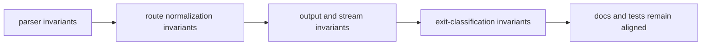

# Invariants

Invariants are behavior guarantees `bijux-cli` should preserve across refactors
and feature additions.

## Visual Summary

## Core Invariants

- parser and alias rewrites produce deterministic normalized paths
- help/version short-circuits stay consistent with root command grammar
- structured payload rendering does not mutate semantic meaning
- unknown-route suggestions remain bounded and deterministic
- plugin namespace conflict rules remain strict and explicit

## Code Anchors

- `crates/bijux-cli/src/routing/parser.rs`
- `crates/bijux-cli/src/routing/model.rs`
- `crates/bijux-cli/src/interface/cli/dispatch.rs`
- `crates/bijux-cli/src/routing/registry.rs`
- `crates/bijux-cli/tests/routing/laws/`

## Invariant Rules

- invariant changes require explicit compatibility review
- invariants should be expressed as tests and docs, not prose alone
- do not silently relax invariants to unblock short-term changes

## Next Reads

- [Review Checklist](review-checklist.md)
- [Compatibility Commitments](../interfaces/compatibility-commitments.md)
- [Architecture Risks](../architecture/architecture-risks.md)
