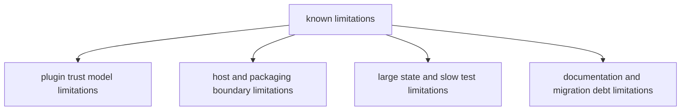

# Known Limitations

This page tracks current limitations that are important for realistic operational
expectations and accurate release communication.

## Visual Summary

## Current Limitations

- plugin execution is trust-based and not fully sandboxed
- delegated tool behavior depends on external binary availability
- large local state can increase diagnostic and listing latency
- some integration suites are intentionally slow and run outside fast defaults

## Code Anchors

- `crates/bijux-cli/src/features/plugins/runtime.rs`
- `crates/bijux-cli/src/interface/cli/dispatch/delegation.rs`
- `crates/bijux-cli/src/features/history/operations.rs`
- `crates/bijux-cli/tests/integration/`

## Limitation Rules

- document limitations clearly rather than masking them as temporary noise
- pair every limitation note with the owning code area
- remove limitation entries only when evidence is merged and verified

## Next Reads

- [Risk Register](risk-register.md)
- [Security and Safety](../operations/security-and-safety.md)
- [Architecture Risks](../architecture/architecture-risks.md)
