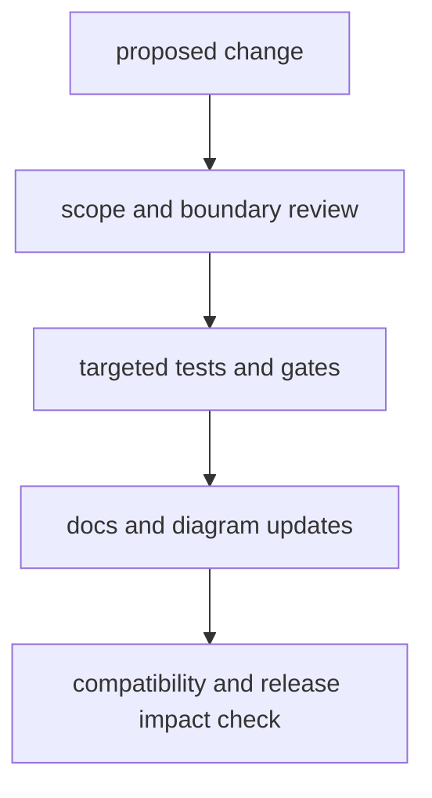

# Review Checklist

Use this checklist for every `bijux-cli` change that touches runtime behavior,
contracts, or documentation.

## Visual Summary

## Checklist

1. Scope: does the change stay in CLI ownership boundaries?
2. Contracts: do command grammar, payloads, or exits change?
3. Tests: are targeted routing/integration/architecture tests updated?
4. Docs: are handbook pages updated with concrete code anchors?
5. Diagrams: do page diagrams still reflect real behavior?
6. Compatibility: are impact notes explicit for script users?
7. Gates: do docs structure and test gates pass?

## Docs Structure Gate

- `docs/bijux-cli/` contains exactly 6 directories and 51 files
- exactly 5 section directories under the package root
- each section contains exactly 10 pages
- each page includes at least one Mermaid diagram

## Code Anchors

- `makes/docs.mk`
- `docs/bijux-cli/`
- `crates/bijux-cli/tests/`

## Next Reads

- [Documentation Standards](documentation-standards.md)
- [Definition of Done](definition-of-done.md)
- [Change Validation](change-validation.md)
