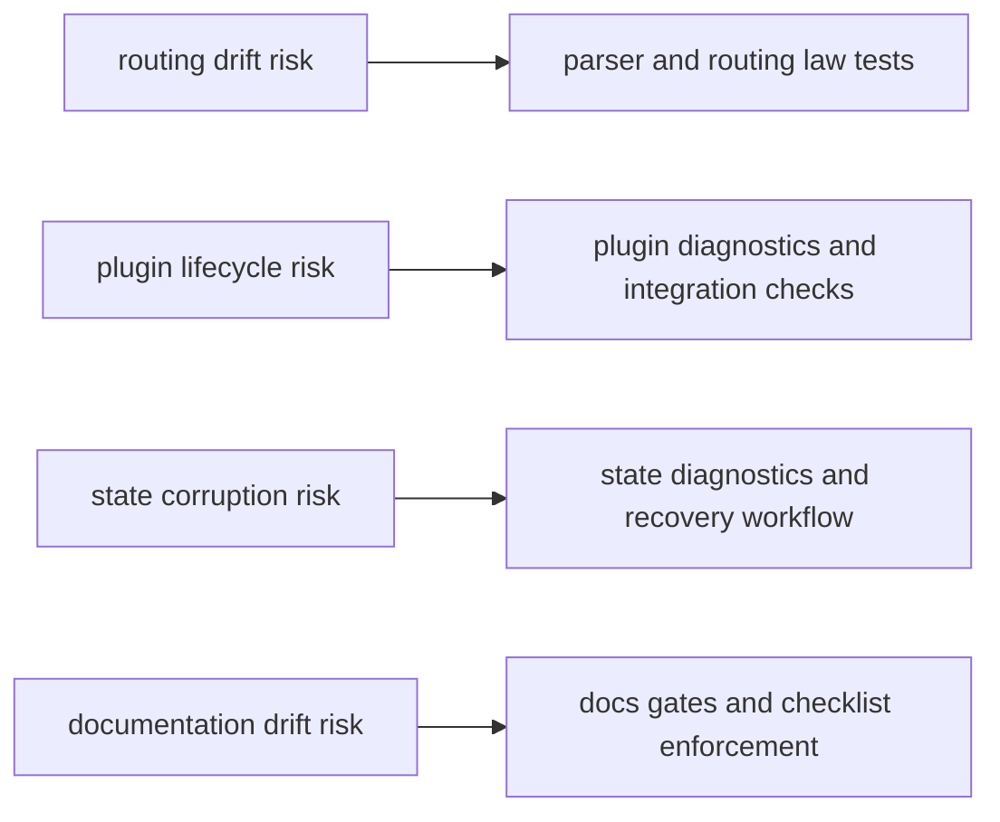

# Risk Register

The risk register tracks the highest-impact technical and operational risks for
`bijux-cli` and the expected mitigation path.

## Visual Summary

## Active Risks

- route and alias drift causing script regressions
- plugin compatibility handling regressions during lifecycle updates
- state-file mutation regressions causing config/history corruption
- documentation drift from command behavior after fast refactors

## Mitigations

- maintain routing laws and golden command-surface tests
- keep plugin lifecycle integration contracts in regular validation loops
- require diagnostics and recovery checks for state write-path changes
- enforce docs shape and review checklist gates for contract changes

## Code Anchors

- `crates/bijux-cli/src/routing/`
- `crates/bijux-cli/src/features/plugins/`
- `crates/bijux-cli/src/features/config/`
- `crates/bijux-cli/tests/`
- `docs/bijux-cli/`

## Next Reads

- [Architecture Risks](../architecture/architecture-risks.md)
- [Change Validation](change-validation.md)
- [Failure Recovery](../operations/failure-recovery.md)
