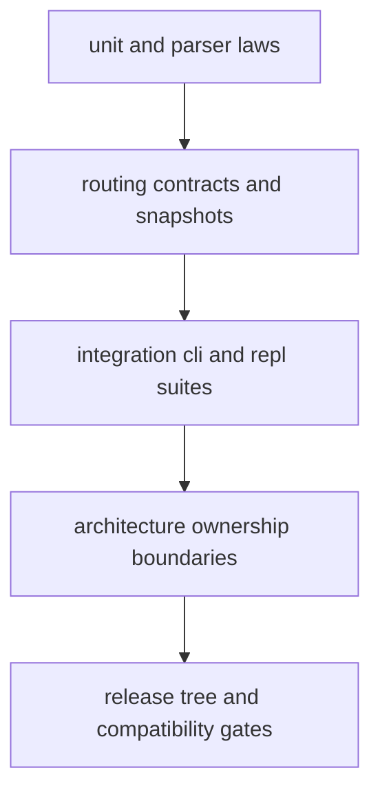

# Test Strategy

`bijux-cli` test strategy layers fast contract checks with integration and
architecture suites to catch behavioral drift early.

## Visual Summary

## Test Layers

- unit tests in source modules for local behavior
- routing suites for parser normalization and route laws
- integration suites for command end-to-end behavior
- architecture suites for boundary and ownership guarantees
- release/contract tests for packaging and schema confidence

## Slow-Test Policy

- tests above 10 seconds should be marked and excluded from default fast gates
- slow suites should run in dedicated gates or explicit invocations
- default `make test` should prioritize quick contract feedback

## Code Anchors

- `crates/bijux-cli/tests/routing/`
- `crates/bijux-cli/tests/integration/`
- `crates/bijux-cli/tests/architecture/`
- `makes/*.mk`

## Test Strategy Rules

- new user-visible behavior requires targeted tests in the owning layer
- snapshot changes need explicit review comments and rationale
- failing architecture tests block merges even if local unit tests pass

## Next Reads

- [Invariants](invariants.md)
- [Change Validation](change-validation.md)
- [Risk Register](risk-register.md)
