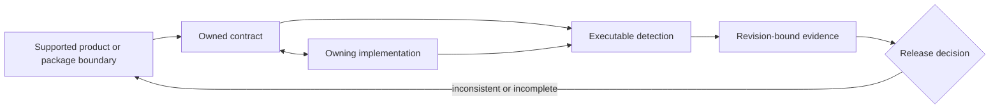

# Architecture Risks

This register covers repository-level failure modes that can invalidate more
than one package or release surface. Product-specific operational risks remain
in the CLI and DAG risk registers.

## Active Risks

| Risk | Failure mode | Detection | Release consequence |
| --- | --- | --- | --- |
| package-boundary drift | a public crate gains a runtime or build dependency on a private crate, or publish order becomes invalid | `foundation_workspace_package_boundary_contracts` compares the governed boundary with Cargo metadata | block crate publication until ownership and dependency direction agree |
| product/maintainer coupling | user runtime code imports repository proof logic or maintainer commands become hidden product entrypoints | source-layout guardrails and package-boundary tests | block the affected runtime release |
| contract divergence | code, schema, generated reference, and handbook describe different behavior | owning contract tests, generated-reference checks, and `make docs-check` | block publication of every surface carrying the inconsistent behavior |
| release identity split | crates, Python package, containers, docs, or evidence are produced from different source identities | release plans, tag checks, package metadata checks, and retained release evidence | discard or rebuild artifacts; never publish a mixed release set |
| retained-evidence ambiguity | reports or artifacts omit provenance, integrity state, or the contract used to interpret them | report producers, artifact integrity checks, and evidence governance contracts | evidence cannot support a release decision |
| configuration drift | local, CI, and release invocations resolve different effective inputs without making the difference visible | configuration precedence contracts and reproducible gate commands | investigate and align inputs before accepting a green result |

## Control Ownership

No single layer can close a repository risk. A handbook can define the
supported boundary but cannot prove it. A passing test can prove one selection
but cannot establish release identity. A retained report can show an
observation but cannot redefine the contract used to interpret it.

## Acceptance Standard

A risk is not mitigated because a handbook says that a control exists.
Mitigation requires all of the following:

- one owner can change the behavior and the control;
- an executable check fails when the invariant is violated;
- the failure names the affected surface rather than reporting a generic gate
  error;
- release guidance states whether the failure blocks publication;
- any accepted exception has a bounded scope, evidence, and removal condition.

## Triage And Escalation

| Observation | First owner | Required response |
| --- | --- | --- |
| Cargo metadata disagrees with the package boundary | package owner and release maintainer | restore dependency direction or deliberately revise the governed package contract before publication |
| product code depends on maintainer implementation | product crate owner | move runtime behavior into the product boundary; keep `bijux-dev` as a consumer of product facts |
| generated reference differs from code | producer and owning product crate | determine intended behavior, regenerate from the producer, and run the reference contract |
| release assets identify different commits | release maintainer | stop publication, discard the mixed set, and rebuild every affected artifact from one source identity |
| evidence lacks terminal status or provenance | evidence producer | mark the claim incomplete and recollect it; never infer a pass |
| local and hosted gates resolve different inputs | owning configuration surface | record effective inputs, identify the governing authority, and align or explicitly bound the difference |

Repository risk is escalated by affected boundary, not by which test happened
to detect it. A failure in a maintainer contract can still block a public
product when the contract proves package ownership, release identity, or
artifact integrity.

## Review Triggers

Review this register when a change:

- adds a workspace crate or changes publication metadata;
- introduces a dependency across product or maintainer families;
- changes a public schema, output envelope, or generated reference;
- adds a release channel or changes artifact provenance;
- creates a new checked-in report or evidence class;
- changes configuration precedence used by CI or release automation.

## Evidence Boundaries

The risk register identifies what must be detected; it is not proof that the
controls passed. Use the current test output and generated evidence for the
reviewed commit. A report from another revision, a focused test presented as a
full gate, or a successful background launch without its final status is not
release evidence.

## Residual Risk Record

When a control cannot close a risk, record the affected product and package,
the exact unsupported or unverified behavior, the evidence available for the
current revision, the release consequence, and the condition that removes the
exception. Avoid percentages such as "mostly mitigated" unless a governed
measurement defines their denominator.

An accepted risk is not a silent waiver. The public handbook must remain
honest about user-visible limits, while internal evidence retains the technical
detail needed to revisit the decision.

## Related Authorities

- [Dependency Direction](dependency-direction.md)
- [Artifact and Contract Flow](artifact-and-contract-flow.md)
- [Risk and Exceptions](../governance/risk-and-exceptions.md)
- [Testing and Validation](../operations/testing-and-validation.md)
- [Documentation System](../foundation/documentation-system.md)
