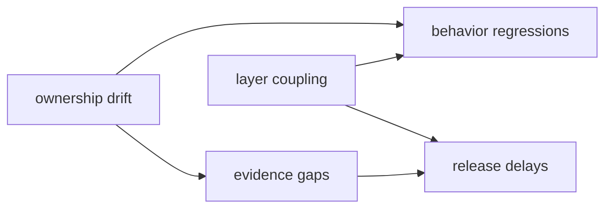

# Architecture Risks

Architecture risks track where structure drift can cause expensive debugging,
compatibility loss, or unreliable release outcomes.

## Visual Summary

## Key Risk Areas

- runtime and maintainer boundaries becoming coupled
- command behavior changing faster than contracts and docs
- schema evolution without migration or compatibility notes
- multiple orchestration paths diverging from shared gates

## Risk Controls

- ownership checks in maintainer suites
- contract tests for replay/diff and output semantics
- docs-check and link validation on every release candidate
- explicit change and decision records for compatibility-sensitive updates

## Code Anchors

- `crates/bijux-dev/tests/source_layout_guardrails.rs`
- `crates/bijux-dag-app/tests/replay_diff_hardening_contract.rs`
- `makes/docs.mk`
- `mkdocs.yml`

## Next Reads

- [Risk and Exceptions](../governance/risk-and-exceptions.md)
- [Change Management](../governance/change-management.md)
- [Release and Versioning](../governance/release-and-versioning.md)
