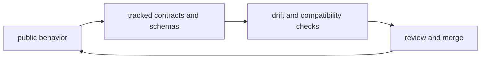

# Artifact and Contract Flow

`bijux-core` does not treat code, schemas, snapshots, and published
documentation as separate stories. A behavioral change is only complete when
the contract that describes it, the generated evidence that proves it, and the
reader-facing documentation that explains it all tell the same story.

That rule is what keeps the repository honest. A passing binary is not enough
if the replay schema, CLI output contract, retained DAG evidence, or published
reference page still describes an older behavior.

## Flow Map

## What Moves Through This Flow

- user-visible command behavior
- runtime manifests, retained run directories, and replay artifacts
- shared schemas and output envelopes under `contracts/`
- checked-in snapshots, golden references, and generated reports
- handbook pages and reference docs that describe supported behavior

## How The Repository Stays Aligned

### 1. Behavior changes in code

The starting point is always a concrete behavior change in a public surface or
in a retained artifact that downstream tooling depends on.

Examples:

- a DAG run writes a new manifest field
- `bijux` prints a different reason code
- a replay or diff command emits a new schema field
- a maintainer report changes structure or vocabulary

### 2. Contracts record the supported shape

When the change affects anything a user, automation pipeline, or published
reference can depend on, the repository expects an explicit contract update.

Those contracts live in a few forms:

- formal schemas and reference assets under `contracts/`
- golden snapshots in crate tests
- generated references checked into `docs/` when the repository publishes them
- release and governance evidence consumed by maintainer tooling

### 3. Validation proves the change is intentional

Contract tests, schema drift checks, snapshot tests, and docs validation are
the point where the repository asks whether every dependent surface changed
together or whether one surface silently drifted.

This is where many regressions are caught:

- code changed but the documented schema did not
- a retained artifact moved but a golden snapshot still expects the old shape
- docs describe a capability that the public binary no longer exposes
- output stayed parseable but changed meaning without a matching vocabulary update

### 4. Review checks coherence, not only correctness

By review time, the code, contracts, generated evidence, and docs should read
as one coherent update. Review should not need guesswork to reconstruct the
real supported state.

## Primary Contract Surfaces

- DAG replay and diff schemas
- CLI output and route contracts
- maintainer evidence schemas and registry outputs
- documentation navigation, generated references, and public examples

## What Usually Requires A Contract Update

You should expect to update contracts or checked references when a change:

- adds, removes, or renames public fields
- changes status vocabularies, reason codes, or envelope structure
- alters retained DAG run-directory layout
- changes generated reference output under `docs/`
- changes compatibility commitments that release notes or package docs describe

## What Usually Does Not

Pure implementation changes often stay local when they do not alter public or
retained meaning.

Common examples:

- internal refactors with identical outputs
- performance work that preserves command semantics and stays within the
  benchmark evidence boundaries recorded in the
  `performance-evidence-report`
- private helper changes in maintainer tooling
- test fixture cleanup that does not alter retained contracts

## Where To Inspect The Truth

Start with the code that owns the behavior, then confirm the contract and
evidence surfaces that describe it:

- `contracts/`
- `crates/bijux-dag-app/tests/`
- `crates/bijux-cli/tests/`
- `crates/bijux-dev/tests/`
- generated references under `docs/` when a public page is derived from code

## Typical Review Question

If a reviewer asks, "what proves this new behavior is the supported behavior?",
the answer should be visible in the same change set through code, contracts,
tests, and documentation.

## Next Reads

- [Testing and Validation](../operations/testing-and-validation.md)
- [Compatibility and Schema](../governance/compatibility-and-schema.md)
- [Release and Versioning](../operations/release-and-versioning.md)
