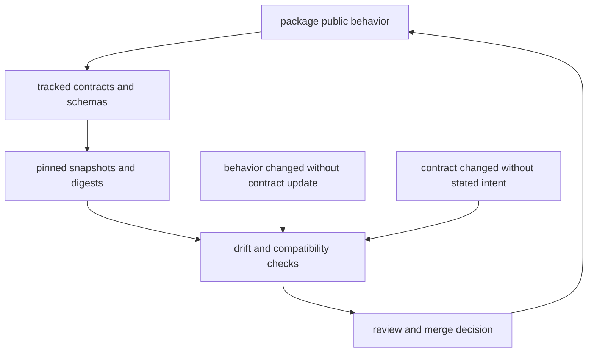

# Artifact and Contract Flow

Artifact and contract flow defines how outputs are generated, validated,
published, and consumed across programs.

## Visual Summary

## Flow Stages

1. commands generate runtime artifacts and maintainer reports
2. contract assets capture schema and output expectations
3. verification suites check lockstep behavior and compatibility
4. docs and releases reference verified contract state

## Contract Surfaces

- DAG replay and diff schemas
- CLI output and route contracts
- maintainer evidence schemas and registry outputs
- documentation layout and link contracts

## Code Anchors

- `contracts/`
- `crates/bijux-dag-app/tests/`
- `crates/bijux-cli/tests/`
- `crates/bijux-dev/tests/`

## Next Reads

- [Testing and Validation](../governance/testing-and-validation.md)
- [Compatibility and Schema](../governance/compatibility-and-schema.md)
- [Documentation Standards](../governance/documentation-standards.md)
