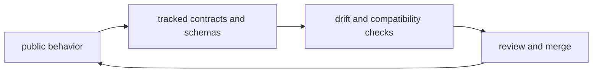

# Artifact and Contract Flow

This page explains how behavior, contracts, and generated artifacts stay in
sync across the repository.

The flow matters because code, snapshots, docs, and release surfaces should all
describe the same verified state rather than drifting independently.

## Flow Map

## Flow Stages

1. commands generate runtime artifacts and maintainer reports
2. contract assets capture schema and output expectations
3. verification suites check lockstep behavior and compatibility
4. docs and releases reference verified contract state

## Contract Surfaces

- DAG replay and diff schemas
- CLI output and route contracts
- maintainer evidence schemas and registry outputs
- documentation layout and link contracts

## Reading Rule

Use this page when a change crosses from implementation into contracts,
snapshots, or generated evidence.

## Code Anchors

- `contracts/`
- `crates/bijux-dag-app/tests/`
- `crates/bijux-cli/tests/`
- `crates/bijux-dev/tests/`

## Next Reads

- [Testing and Validation](../governance/testing-and-validation.md)
- [Compatibility and Schema](../governance/compatibility-and-schema.md)
- [Documentation Standards](../governance/documentation-standards.md)
