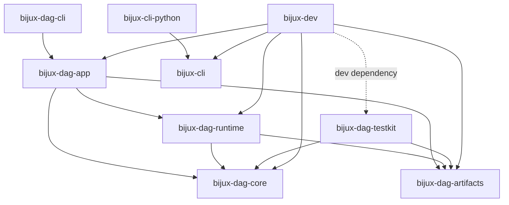

# Dependency Direction

Dependency direction in `bijux-core` protects three different concerns:
product execution, reusable test support, and repository governance. A package
edge is acceptable only when the package being imported owns a narrower or
lower-level responsibility. Similar command names or shared release ownership
do not justify a dependency.

## Workspace Graph

The solid arrows below are direct, normal Cargo dependencies. The dashed arrow
is a development-only dependency.

`bijux-cli` has no Cargo dependency on the DAG packages. Product mounting is a
route and process integration concern, not permission to import DAG
implementation code into the general command runtime.

## Package Rules

| Package | May depend on | Boundary protected by that direction |
| --- | --- | --- |
| `bijux-dag-core` | third-party data, hashing, and error libraries | graph meaning remains deterministic and free of process, filesystem, environment, and clock access |
| `bijux-dag-artifacts` | serialization, hashing, and error libraries | persisted evidence remains independent of scheduling and command presentation |
| `bijux-dag-runtime` | core and artifacts | execution may consume graph meaning and write evidence, but cannot import app or CLI routing |
| `bijux-dag-app` | core, runtime, and artifacts | use-case orchestration may compose lower layers without reaching into runtime-private modules |
| `bijux-dag-cli` | app | argument parsing and terminal presentation remain at the outer edge |
| `bijux-dag-testkit` | core and artifacts | shared fixtures can construct domain values and inspect evidence without becoming a product dependency |
| `bijux-cli-python` | `bijux-cli` | the native bridge exposes the Rust command contract instead of implementing a second runtime |
| `bijux-dev` | public product crates; testkit for development | governance can inspect and prove product behavior, while product crates remain free of maintainer code |

These are direct-dependency permissions, not invitations to expose internals.
For example, `bijux-dag-app` depends on `bijux-dag-runtime` but is explicitly
forbidden from importing `runtime_core`.

## Integration Without A Cargo Edge

The Python package has two distinct integration paths:

- its native extension links to `bijux-cli`
- its DAG SDK resolves and invokes `bijux-dag --json` as a subprocess

The subprocess boundary is deliberate. Installing the Python `bijux-cli`
distribution does not install `bijux-dag`, and the SDK must report a missing or
incompatible DAG executable rather than silently substituting another
implementation. `BIJUX_BIN` and the DAG executable resolver are runtime
selection mechanisms; they do not change package ownership.

## Enforced Invariants

The graph is not governed by this page alone:

- `dependency_boundary_contracts.rs` derives direct dependencies from
  `cargo metadata` and enforces allowlists for core, runtime, and governance
- `no_core_io.rs` rejects filesystem, process, environment, and time access in
  DAG core source
- `no_runtime_in_core.rs` rejects the reverse core-to-runtime edge
- `no_cli_in_runtime.rs` rejects runtime dependencies on DAG app and CLI
- `maintainer_leakage_boundaries.rs` rejects maintainer assembly in the Python
  bridge
- workspace package-boundary contracts classify public, internal, and
  non-publishable packages independently of dependency direction

When the intended graph changes, update Cargo metadata and the enforcing test
in the same commit. Editing this diagram alone does not authorize a new edge.

## Review A Proposed Edge

Before adding a workspace dependency, answer these questions:

1. Which package owns the behavior being reused?
2. Is the proposed consumer at the same or an outer architectural layer?
3. Can a schema, public query, serialized value, or subprocess boundary avoid
   importing implementation code?
4. Would the edge make product execution depend on test or governance code?
5. Which contract test will reject a future reverse dependency?

Reject an edge when ownership is unclear. If two packages each need the
other's behavior, the problem is usually a missing narrow contract or a
misplaced responsibility, not a reason to create a cycle.

## Source Anchors

- `Cargo.toml`
- `crates/bijux-dev/tests/dependency_boundary_contracts.rs`
- `crates/bijux-dev/tests/no_core_io.rs`
- `crates/bijux-dev/tests/no_runtime_in_core.rs`
- `crates/bijux-dev/tests/no_cli_in_runtime.rs`
- `crates/bijux-cli-python/tests/maintainer_leakage_boundaries.rs`
- `crates/bijux-cli-python/python/bijux_cli_py/_runtime.py`

## Related Decisions

- [System Overview](system-overview.md)
- [Runtime Surfaces](runtime-surfaces.md)
- [Maintainer Surface](maintainer-control-plane.md)
- [Workspace Topology](workspace-topology.md)
