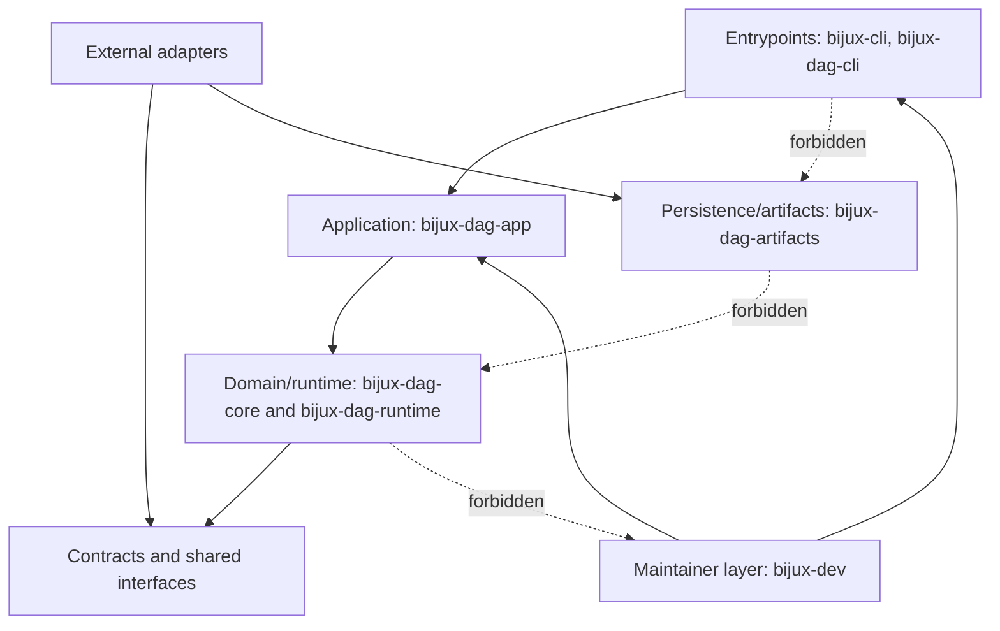

# Dependency Direction

Dependency direction keeps program behavior stable by enforcing which crates may
depend on which layers.

## Visual Summary

## Direction Rules

- product crates must not depend on maintainer-only crates
- maintainer crate may depend on product contracts for verification
- DAG app/runtime/core/artifacts keep DAG-local boundaries explicit
- Python bridge depends on runtime surfaces and does not redefine contracts

## Violation Signals

- runtime crate importing maintainer-specific modules
- DAG core importing app-route modules
- duplicate policy logic in multiple binary entrypoints

## Code Anchors

- `crates/bijux-cli/Cargo.toml`
- `crates/bijux-dag-app/Cargo.toml`
- `crates/bijux-dag-runtime/Cargo.toml`
- `crates/bijux-dev/Cargo.toml`

## Next Reads

- [Maintainer Control Plane](maintainer-control-plane.md)
- [Testing and Validation](../governance/testing-and-validation.md)
- [Change Management](../governance/change-management.md)
