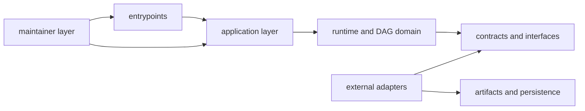

# Dependency Direction

This page explains which dependency moves the repository treats as normal and
which ones it treats as architectural drift.

The goal is not purity for its own sake. Direction matters because it keeps
runtime behavior, DAG behavior, and maintainer proof from collapsing into one
another.

## Dependency Map

## Direction Rules

- product crates must not depend on maintainer-only crates
- maintainer crate may depend on product contracts for verification
- DAG app/runtime/core/artifacts keep DAG-local boundaries explicit
- Python bridge depends on runtime surfaces and does not redefine contracts

## Violation Signals

- runtime crate importing maintainer-specific modules
- DAG core importing app-route modules
- duplicate policy logic in multiple binary entrypoints

## Dependency Review

Review a proposed dependency against the owned direction before accepting its
local convenience. A dependency that weakens the repository split is an
architecture change, not an implementation detail.

## Code Anchors

- `crates/bijux-cli/Cargo.toml`
- `crates/bijux-dag-app/Cargo.toml`
- `crates/bijux-dag-runtime/Cargo.toml`
- `crates/bijux-dev/Cargo.toml`

## Boundary References

- [Maintainer Control Plane](maintainer-control-plane.md)
- [Testing and Validation](../operations/testing-and-validation.md)
- [Change Management](../operations/change-management.md)
