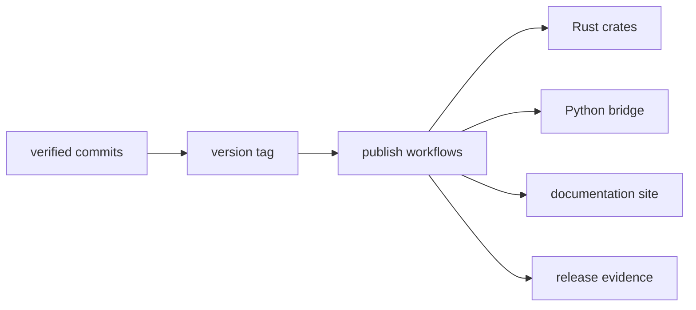

# Distribution Model

This page explains how `bijux-core` ships runtime capabilities without splitting
the repository into disconnected release stories.

The important point is that distribution follows repository truth. Tags,
published packages, docs, and release evidence are all supposed to describe the
same verified state.

## Distribution Flow

## Distribution Surfaces

- Rust crate release channels for applicable published crates
- Python package release for `bijux-cli-python`
- repository documentation publication via MkDocs pipeline
- build and evidence artifacts for validation and governance

## Distribution Rules

- release channels must map to tagged, verified repository state
- runtime identity must stay consistent across CLI and Python surfaces
- maintainer tooling remains repository-owned and audit-focused

## Reading Rule

Use this page when the question is how one repository turns into several public
delivery surfaces without losing coherence.

## Code Anchors

- `.github/workflows/`
- `crates/bijux-cli-python/`
- `tools/release/`
- `makes/gh.mk`

## Next Reads

- [Release and Versioning](../governance/release-and-versioning.md)
- [Compatibility and Schema](../governance/compatibility-and-schema.md)
- [Decision Record Policy](../governance/decision-record-policy.md)
