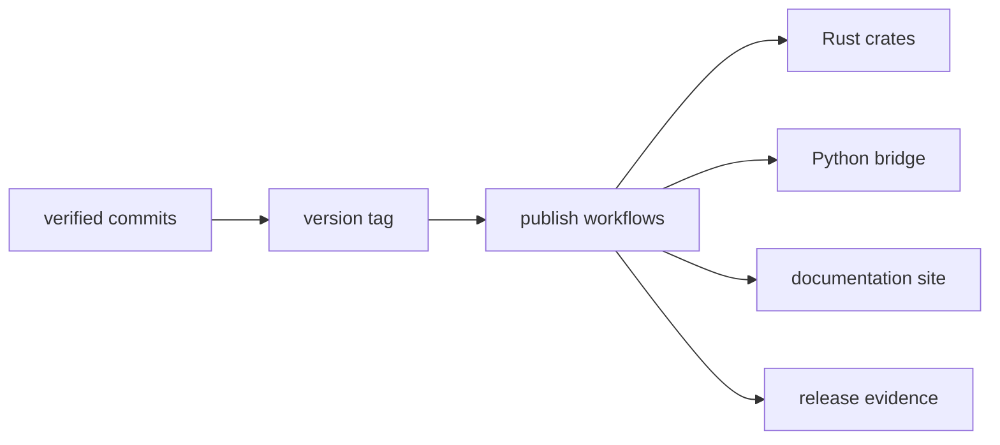

# Distribution Model

`bijux-core` ships several public surfaces from one repository. That only works
if release outputs all point back to the same verified source state instead of
drifting into separate stories.

In practice, that means a tag, a crate release, Python packaging output,
published documentation, and release evidence should all describe the same
repository truth. If one surface advertises more or less than the tagged source
actually supports, the distribution model has failed.

## Distribution Flow

## Public Distribution Surfaces

- Rust crate release channels for applicable published crates
- Python package release for `bijux-cli-python`
- repository documentation publication via MkDocs pipeline
- build and evidence artifacts for validation and governance

## What This Repository Actually Ships

The repository does not publish every crate equally.

- public Rust crates carry the `bijux` and `bijux-dag` runtime families to
  crates.io
- the Python bridge packages the CLI-facing surface for Python consumers
- the docs site publishes reader-facing guidance and generated references
- release evidence proves what was built, verified, and published from a tag

The distribution model is therefore not just "publish all crates." It is a
controlled release of the repository's public product surfaces.

## Distribution Rules

- release channels must map to tagged, verified repository state
- runtime identity must stay consistent across CLI and Python surfaces
- maintainer tooling remains repository-owned and audit-focused

## Why Repository Truth Comes First

Readers encounter the repository through different entry points:

- crates.io package pages
- Python package consumers
- published docs and CLI references
- release notes and evidence artifacts

Those entry points can only be trusted if they all describe the same release
boundary. The repository therefore treats distribution as a coordination
problem, not just a packaging problem.

## Typical Sources Of Drift

Distribution becomes misleading when one surface moves without the others. The
most common failure modes are:

- docs promise a command or field that the released tag does not contain
- a public crate is released without matching compatibility notes
- Python packaging presents a different runtime identity than the CLI release
- release evidence or workflow matrices omit a published surface

## Where Distribution Ownership Lives

The release story is spread across a small number of root surfaces:

- `.github/workflows/`
- `crates/bijux-cli-python/`
- `.github/release.env`
- `makes/gh.mk`

Those files are the right starting points when the question is not "how does
this crate work?" but "how does this verified repository become a public
release?"

## What Readers Should Expect From A Good Release

A release is in good shape when:

- the public crate set matches published documentation
- tagged source and release automation agree on version identity
- generated references and package READMEs match shipped capabilities
- evidence artifacts can explain what was built and from which source revision

## Next Reads

- [Release and Versioning](../operations/release-and-versioning.md)
- [Compatibility and Schema](../governance/compatibility-and-schema.md)
- [Decision Record Policy](../governance/decision-record-policy.md)
