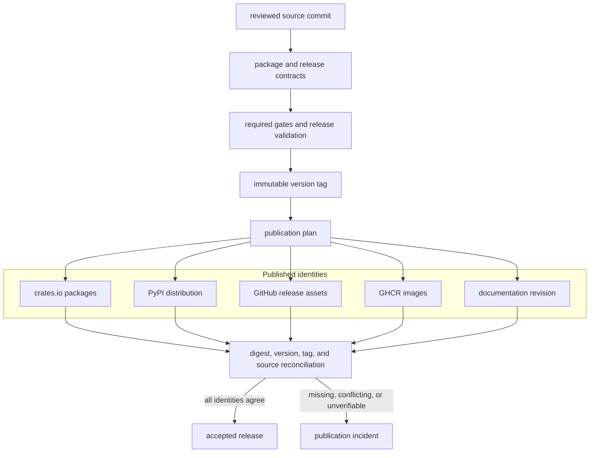

# Distribution Model

`bijux-core` publishes multiple artifacts from one source identity: Rust
crates, the Python `bijux-cli` distribution, release bundles, container images,
and documentation. A release is coherent only when every artifact can be
traced to the same reviewed commit and the package boundary declares it
publishable.

## Distribution Flow

Tag creation is the transition from mutable candidate to immutable release
identity. Publication is not accepted at upload time; it is accepted after
external identities and digests reconcile with that tag.

## Published Surfaces

| Surface | Product role | Identity that must reconcile | Not published from this repository |
| --- | --- | --- | --- |
| `bijux-cli` on crates.io | native `bijux` runtime | crate version, checksum, repository, and tag | `bijux-dev` |
| `bijux-cli` on PyPI | Python launcher, native bridge, and Python API | wheel/sdist version, supported interpreter tags, native runtime parity, and tag | `bijux-dag` executable |
| DAG crates on crates.io | graph, artifact, runtime, application, and command packages | dependency order, crate versions, checksums, and tag | `bijux-dag-testkit` |
| GitHub release assets | stamped CLI and DAG binary families | archive digest, embedded version, platform, and tag | local validation artifacts |
| GHCR | packaged CLI and DAG executables | image digest, labels, executable version, and tag | a claim of host or cluster isolation |
| documentation site | supported behavior and generated references | deployed revision and release boundary | internal specifications and governed reports |

The machine-readable package set and publication status live in
`contracts/foundation/workspace_package_boundary.v1.json`. Release workflows
consume that boundary; prose does not expand it.

## Identity Handoffs

| Handoff | Required proof | Refusal condition |
| --- | --- | --- |
| source to candidate | clean source identity and required selected gates | dirty, ambiguous, or unverified source |
| candidate to tag | release validation, package plan, compatibility review, and documentation integrity | any required proof missing or generated policy misaligned |
| tag to artifact | reproducible build inputs and artifact metadata bound to the tag | artifact cannot identify the tagged source |
| artifact to registry | accepted external version and immutable digest or checksum | conflict, partial upload, or wrong repository identity |
| registry to release acceptance | complete inventory across registries, assets, images, and docs | any surface absent, conflicting, or unverifiable |

## Drift And Incident Triggers

Distribution becomes misleading when one surface moves without the others. The
release must stop when:

- docs promise a command or field that the released tag does not contain
- a public crate is released without matching compatibility notes
- Python packaging presents a different runtime identity than the CLI release
- release evidence or workflow matrices omit a published surface
- a package, archive, image, or deployed site resolves to a different commit
- publication succeeds only partially and a retry could create conflicting
  external state

## Distribution Authorities

The principal authorities are:

- `contracts/foundation/workspace_package_boundary.v1.json` for package status
  and order;
- `.github/release.env` and generated workflow policy for release orchestration;
- package manifests for distribution metadata;
- the version tag for immutable source identity;
- release evidence for the observed result of validation and publication.

When these sources disagree, publication remains incomplete. A successful
individual upload cannot override the package boundary, repair a mixed source
identity, or prove that omitted surfaces were reconciled.

## Distribution References

- [Release and Versioning](../operations/release-and-versioning.md)
- [Compatibility and Schema](../governance/compatibility-and-schema.md)
- [Decision Record Policy](../governance/decision-record-policy.md)
