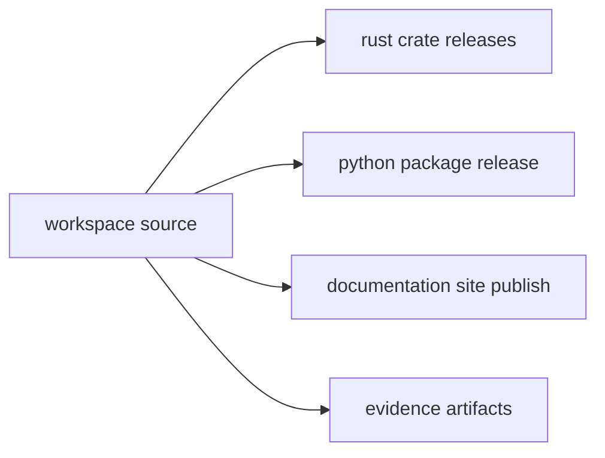

# Distribution Model

Distribution model defines how runtime and maintainer capabilities are shipped
without splitting repository ownership.

## Visual Summary

## Distribution Surfaces

- Rust crate release channels for applicable published crates
- Python package release for `bijux-cli-python`
- repository documentation publication via MkDocs pipeline
- build and evidence artifacts for validation and governance

## Distribution Rules

- release channels must map to tagged, verified repository state
- runtime identity must stay consistent across CLI and Python surfaces
- maintainer tooling remains repository-owned and audit-focused

## Code Anchors

- `.github/workflows/`
- `crates/bijux-cli-python/`
- `tools/release/`
- `makes/gh.mk`

## Next Reads

- [Release and Versioning](../governance/release-and-versioning.md)
- [Compatibility and Schema](../governance/compatibility-and-schema.md)
- [Decision Record Policy](../governance/decision-record-policy.md)
