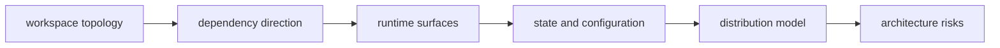

# Core Architecture

This section defines the repository-level architecture that coordinates CLI,
DAG, Python bridge, and maintainer control-plane responsibilities.

## Visual Summary

## Architecture Priorities

- one workspace authority at the repository root
- explicit crate ownership with one-way dependency rules
- stable command and artifact behavior across CLI and DAG programs
- maintainers operate through dedicated control-plane paths

## Pages In This Section

- [System Overview](system-overview.md)
- [Workspace Topology](workspace-topology.md)
- [Dependency Direction](dependency-direction.md)
- [Runtime Surfaces](runtime-surfaces.md)
- [State and Configuration](state-and-configuration.md)
- [Distribution Model](distribution-model.md)
- [Maintainer Control Plane](maintainer-control-plane.md)
- [Artifact and Contract Flow](artifact-and-contract-flow.md)
- [Architecture Risks](architecture-risks.md)
