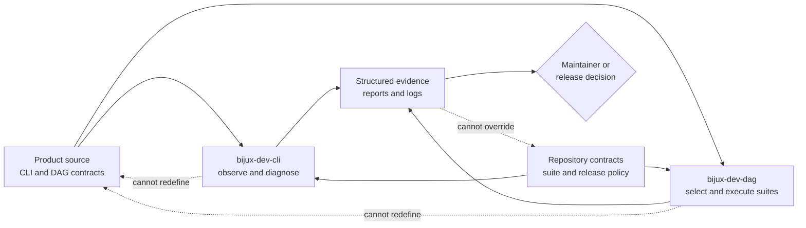

# Maintainer Control Plane

The maintainer control plane observes, proves, and releases `bijux-core`
without becoming part of its public runtime semantics. Product code and
contracts remain authoritative. Maintainer commands consume those facts,
execute governed checks, and produce revision-bound evidence for a human or
release process to evaluate.

## Authority And Evidence Flow

The reverse dotted edges are forbidden authority transfers. A green report
cannot make an unsupported feature stable, and a maintainer command cannot
substitute its own meaning for a product command or retained DAG artifact.

## Two Entrypoints, Two Responsibilities

| Entrypoint | Owns | Does not own |
| --- | --- | --- |
| `bijux-dev-cli` | repository and product observation, quick checks, parity and status diagnostics, maintenance audits, documentation operations, structured reports | suite policy, product routing, DAG execution semantics |
| `bijux-dev-dag` | suite catalogs, policy and contract execution, repository checks, evidence aggregation, release-proof composition | alternate CLI or DAG behavior, unilateral release approval |
| Make targets | reproducible composition and tool invocation | hidden policy absent from an owning suite or contract |
| CI workflows | isolated execution, credentials, retention, and status publication | a second implementation of local checks |

Commands that look similar across the two binaries are not automatically the
same contract. Route a change through the entrypoint that owns its data model,
exit meaning, side effects, and evidence schema.

## Dependency Boundary

`bijux-dev` may depend on public product crates because governance needs to
inspect their contracts. The product crates do not depend on `bijux-dev`.
This direction protects three properties:

- installing a product does not install repository governance machinery;
- release checks can exercise public behavior without introducing hidden
  runtime paths;
- removing or changing a maintainer report cannot change product execution.

Shared fixtures may be development dependencies. They do not become runtime
dependencies or public APIs merely because the control plane uses them.

## Decision Record

A control-plane result is decision-ready only when it records:

| Required fact | Why it matters |
| --- | --- |
| source revision and worktree state | binds the observation to exact source |
| selected repository, package, suite, or command | prevents a narrow check from being presented as repository-wide |
| contract and policy inputs | identifies the authority evaluated |
| terminal status, exit meaning, and exclusions | distinguishes completion from partial or skipped work |
| report schema and producer version | makes evidence readable after tooling changes |
| artifact location and integrity where applicable | makes the result inspectable and transferable |
| environment and backend limitations | prevents simulated or local proof from becoming a broader claim |

Generated output under `artifacts/` is local evidence, not checked-in
authority. A maintained report under `docs/reports/` is trustworthy only when
its producer, inputs, validation, and source identity remain available.

## Failure Attribution

| Failure | Owning boundary |
| --- | --- |
| public command, graph, runtime, or artifact behavior is wrong | owning CLI or DAG package |
| repository contract or suite selection is wrong | `contracts/`, policy configuration, or `bijux-dev` suite owner |
| report contradicts its inputs | report producer or schema owner |
| local and CI results differ | Make composition, workflow environment, toolchain, or credential boundary |
| release proof is incomplete | release orchestration; the missing proof must not be inferred |

When product behavior must change, update the owning implementation, contract,
tests, and product handbook first. The control plane should then consume the
new authority. Patching the report or maintainer command alone leaves the
product contract unchanged.

## Code Anchors

- `crates/bijux-dev/src/bin/bijux-dev-cli.rs`
- `crates/bijux-dev/src/main.rs`
- `crates/bijux-dev/src/maintainer/`
- `crates/bijux-dev/src/commands/`
- `crates/bijux-dev/src/suites/`
- `crates/bijux-dev/src/report/`
- `contracts/foundation/maintainer_command_surface.v1.json`

## Continue Reading

- [Dependency Direction](dependency-direction.md)
- [Maintainer Ownership Model](../../bijux-dev/governance/ownership-model.md)
- [Command Surface](../../bijux-dev/operations/command-surface.md)
- [Repository Gates](../../bijux-dev/operations/repository-gates.md)
- [Evidence Collection](../../bijux-dev/operations/evidence-collection.md)
