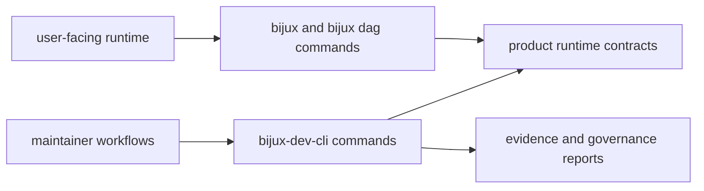

# Maintainer Control Plane

Maintainer control-plane capabilities are isolated from end-user runtime paths
so governance automation does not distort product command behavior.

## Visual Summary

## Control-Plane Responsibilities

- repository structure and contract audits
- evidence generation and verification workflows
- release readiness and compatibility checks
- documentation governance and layout validation

## Separation Rules

- product runtime crates do not import maintainer command logic
- maintainer crate may call product contracts as read-only inputs
- operational decisions must be explainable from generated evidence

## Code Anchors

- `crates/bijux-dev/src/commands/mod.rs`
- `crates/bijux-dev/src/suites/`
- `crates/bijux-dev/src/report/`
- `crates/bijux-dev/src/maintainer/`

## Next Reads

- [Dependency Direction](dependency-direction.md)
- [Repository Gates](../../bijux-dev/operations/repository-gates.md)
- [Quality Policy](../../bijux-dev/governance/quality-policy.md)
